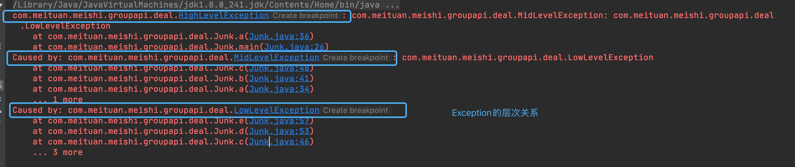
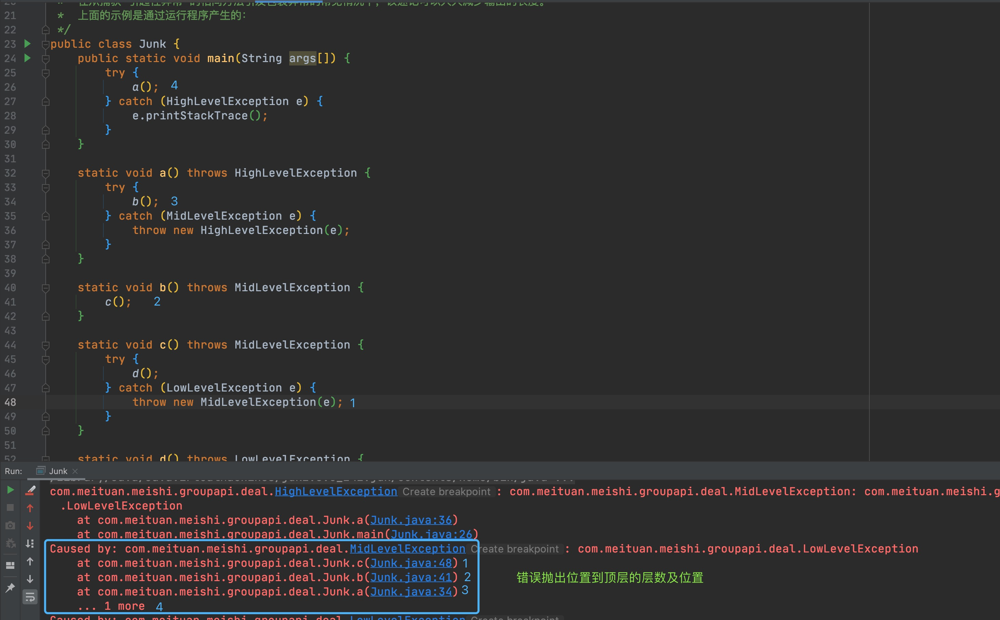

- [java异常的栈轨迹](https://blog.csdn.net/xybelieve1990/article/details/48680003)
- [java常用类解析七：java异常机制、异常栈、异常处理方式、异常链、异常丢失](https://blog.csdn.net/Touch_2011/article/details/6860043)
- 要解决的问题
1. 怎么调用的printstacktrace方法
    1. try catch内部
    2. 抛到最外层（main方法）
        1. mvc打印到网页上肯定是有全局catch，所以没抛出到main，可以再看下tomcat之类的
2. printstacktrace内部是什么样的
    在Throwable类中，所有的Exception和Error都继承了这个
    ```java
    public void printStackTrace() {
        printStackTrace(System.err);
    }
   ```
   重点在与`System.err`这是个啥，是一个PrintStream
   类似System.out，错误信息会放到这里
   
   ```java
        public static void setErr(PrintStream err) {
            checkIO();
            setErr0(err);
        }
    ```
   来源于
   ```java
     public synchronized Throwable fillInStackTrace() {
            if (stackTrace != null ||
                backtrace != null /* Out of protocol state */ ) {
                fillInStackTrace(0);
                stackTrace = UNASSIGNED_STACK;
            }
            return this;
        }
   ```
   
   而这个函数在创建Throwable的构造函数处调用了
   ```java
    public Throwable(String message, Throwable cause) {
        fillInStackTrace();
        detailMessage = message;
        this.cause = cause;
    }
    ```




直接遇到异常时候调用的是无参构造器，也可以调用有参构造器，主要就是这两个构造器以及逐层调用逻辑

throw new RuntimeException时候调用了构造函数
那么没有显示的throw(1.NPE 2.非运行时异常)时是怎么构造异常的，非运行时肯定是有构造的地方的
NPE等应该在各个实现的位置，比如Object类里？如除0错误，应该是在[/]这个函数里实现的。
我们以BigDecimal的除法做例子就会有throw的操作
```java
  public BigDecimal divide(BigDecimal divisor) {
        /*
         * Handle zero cases first.
         */
        if (divisor.signum() == 0) {   // x/0
            if (this.signum() == 0)    // 0/0
                throw new ArithmeticException("Division undefined");  // NaN
            throw new ArithmeticException("Division by zero");
        }
```

```java

    private synchronized StackTraceElement[] getOurStackTrace() {
        // Initialize stack trace field with information from
        // backtrace if this is the first call to this method
        if (stackTrace == UNASSIGNED_STACK ||
            (stackTrace == null && backtrace != null) /* Out of protocol state */) {
            int depth = getStackTraceDepth();
            stackTrace = new StackTraceElement[depth];
            for (int i=0; i < depth; i++)
                stackTrace[i] = getStackTraceElement(i);
        } else if (stackTrace == null) {
            return UNASSIGNED_STACK;
        }
        return stackTrace;
    }
```

然后从反面举个例子。
HotSpot VM有个许多人觉得“匪夷所思”的优化，叫做fast throw：
有些特定的隐式异常类型（NullPointerException、ArithmeticException
（ / 0）之类）如果在代码里某个特定位置被抛出过多次的话，
HotSpot Server Compiler（C2）会透明的决定用fast throw来优化
这个抛出异常的地方——直接抛出一个事先分配好的、类型匹配的异常对象。
这个对象的message和stack trace都被清空。抛出这个异常的速度是非常快，
不但不用额外分配内存，而且也不用爬栈；
但反面就是可能正好是需要知道哪里出问题的时候看不到stack trace了。
从Sun JDK5开始要避免C2做这个优化还得额外传个VM参数：
-XX:-OmitStackTraceInFastThrow。
覆写fillInStackTrace()为直接返回this就像是人肉做C2所做的那种优化…
的一部分效果。反正肯定会有人抱怨这样不好的啦，
是不是要顶住压力硬上就看到底在特定场景里带来的性能好处是不是真的那么重要了。

在这打印
```java
private void printStackTrace(PrintStreamOrWriter s) {
        // Guard against malicious overrides of Throwable.equals by
        // using a Set with identity equality semantics.
        Set<Throwable> dejaVu =
            Collections.newSetFromMap(new IdentityHashMap<Throwable, Boolean>());
        dejaVu.add(this);

        synchronized (s.lock()) {
            // Print our stack trace
            s.println(this);
            StackTraceElement[] trace = getOurStackTrace();
            for (StackTraceElement traceElement : trace)
                s.println("\tat " + traceElement);

            // Print suppressed exceptions, if any
            for (Throwable se : getSuppressed())
                se.printEnclosedStackTrace(s, trace, SUPPRESSED_CAPTION, "\t", dejaVu);

            // Print cause, if any
            Throwable ourCause = getCause();
            if (ourCause != null)
                ourCause.printEnclosedStackTrace(s, trace, CAUSE_CAPTION, "", dejaVu);
        }
    }
```

fillInStackTrace 怎么把stack里的都放进去的，直接return this就没有历史栈。应该是fill里除了return this 里的其他所有
```java
 public synchronized Throwable fillInStackTrace() {
        if (stackTrace != null ||
            backtrace != null /* Out of protocol state */ ) {
            fillInStackTrace(0);
            stackTrace = UNASSIGNED_STACK;
        }
        return this;
    }
```