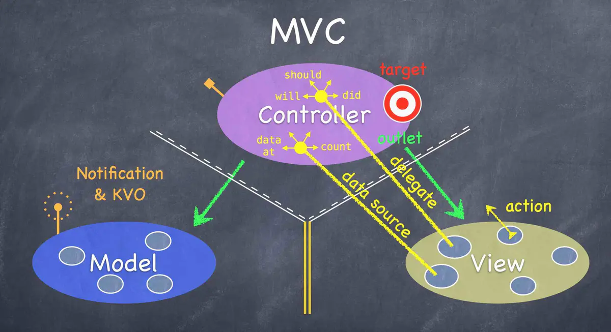

MVVM是MVC的改进版。我们都知道MVC软件架构模式是苹果推荐的开发模式。

MVC中的M就是单纯的从网络获取回来的数据模型，V指的我们的视图界面，而C就是我们的ViewController。

在其中，ViewController负责View和Model之间调度，View发生交互事件会通过target-action或者delegate方式回调给ViewController，与此同时ViewController还要承担把Model通过KVO、Notification方式传来的数据传输给View用于展示的责任。随着业务越来越复杂，视图交互越复杂，导致Controller越来越臃肿，负重前行。脏活累活都它干了，到头来还一点不讨好。福报修多了的结果就是，不行了就重构你，重构不了就换掉你。

来一张斯坦福老头经典的MVC架构图。

所以为了解决这个问题，MVVM就闪亮登场了。他把View和Contrller都放在了View层（相当于把Controller一部分逻辑抽离了出来），Model层依然是服务端返回的数据模型。而ViewModel充当了一个UI适配器的角色，也就是说View中每个UI元素都应该在ViewModel找到与之对应的属性。除此之外，从Controller抽离出来的与UI有关的逻辑都放在了ViewModel中，这样就减轻了Controller的负担。

我简单的画了下MVVM的架构图。

从以上的架构图中，我们可以很清晰的梳理出各自的分工。

View层：视图展示。包含UIView以及UIViewController，View层是可以持有ViewModel的。
ViewModel层：视图适配器。暴露属性与View元素显示内容或者元素状态一一对应。一般情况下ViewModel暴露的属性建议是readOnly的，至于为什么，我们在实战中会去解释。还有一点，ViewModel层是可以持有Model的。
Model层：数据模型与持久化抽象模型。数据模型很好理解，就是从服务器拉回来的JSON数据。而持久化抽象模型暂时放在Model层，是因为MVVM诞生之初就没有对这块进行很细致的描述。按照经验，我们通常把数据库、文件操作封装成Model，并对外提供操作接口。（有些公司把数据存取操作单拎出来一层，称之为DataAdapter层，所以在业内会有很多MVVM的变种，但其本质上都是MVVM）。
Binder：MVVM的灵魂。可惜在MVVM这几个英文单词中并没有它的一席之地，它的最主要作用是在View和ViewModel之间做了双向数据绑定。如果MVVM没有Binder，那么它与MVC的差异不是很大。
我们发现，正是因为View、ViewModel以及Model间的清晰的持有关系，所以在三个模块间的数据流转有了很好的控制。
``