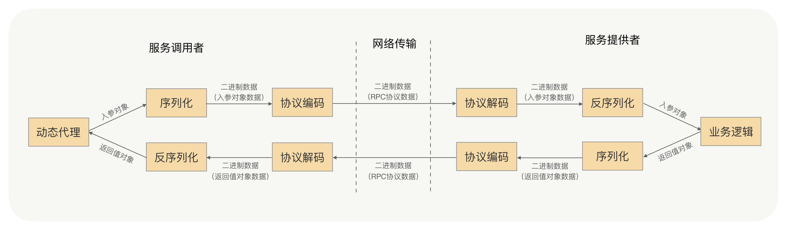
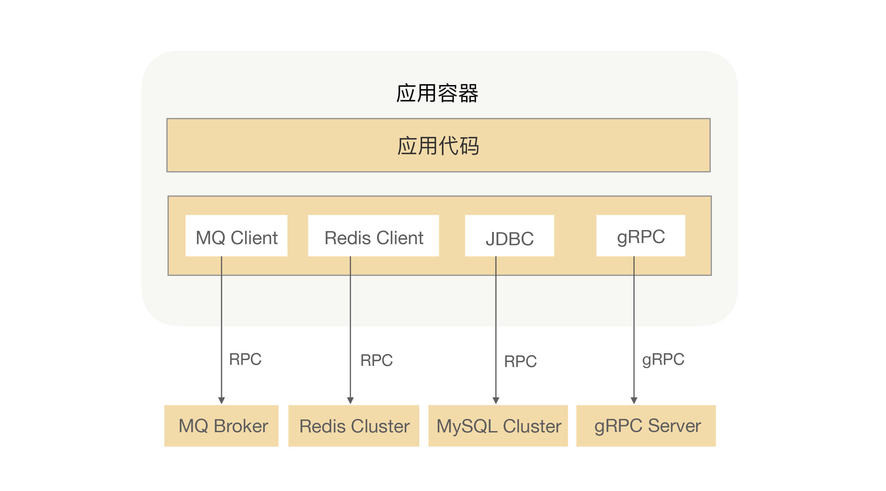
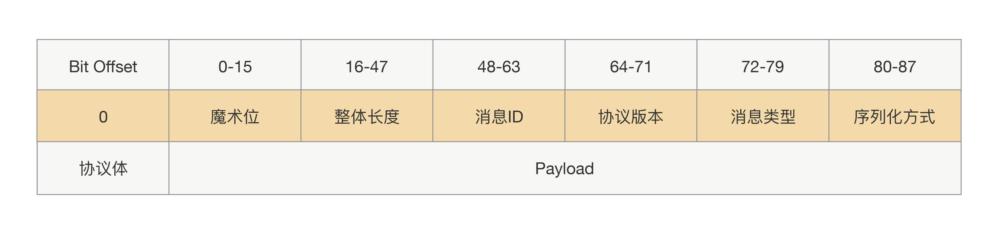
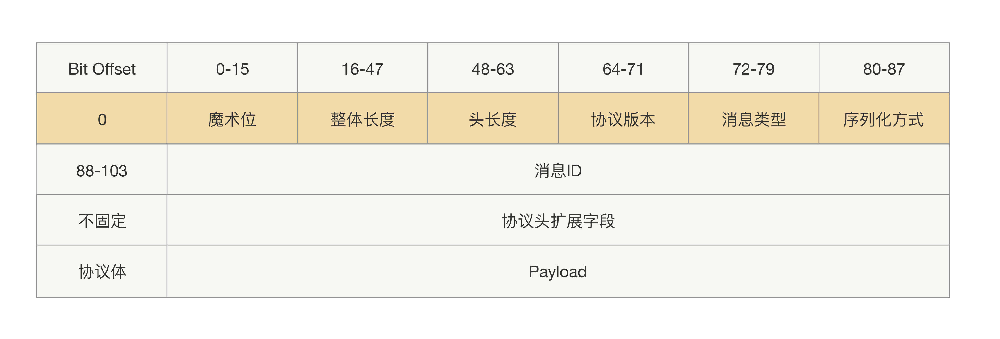
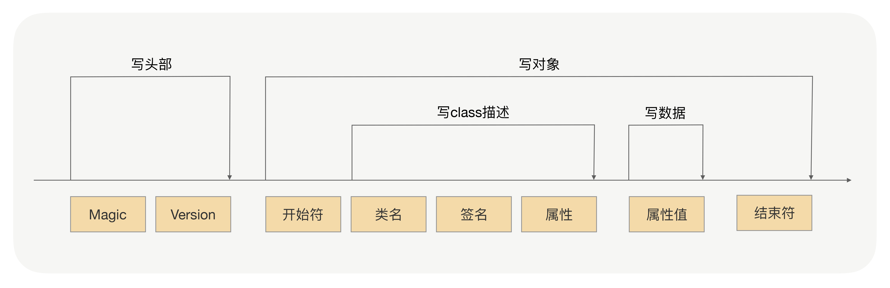
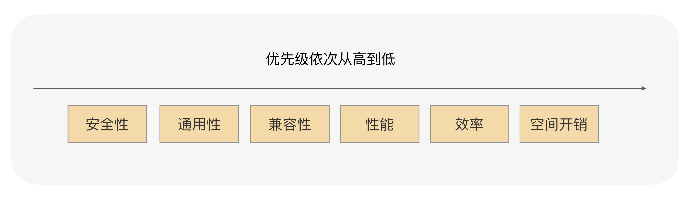
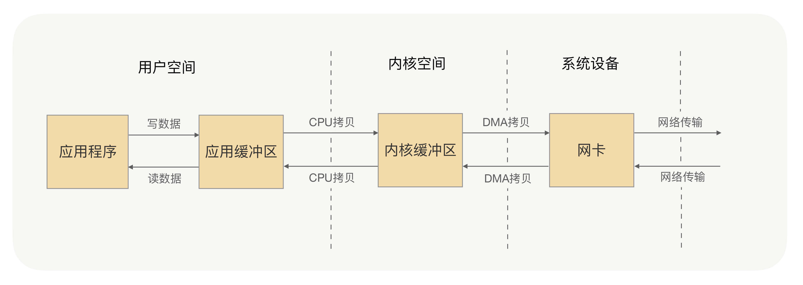
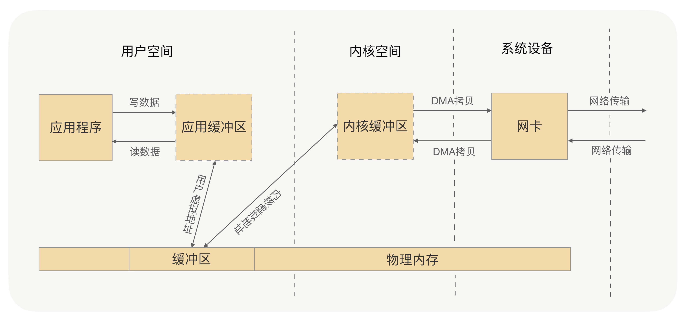

RPC是解决分布式系统通信问题的一大利器，使用RPC可以像调用本地一样发起远程调用。
RPC会涉及到序列化、编解码以及网络传输等基础实现，以及强大的治理功能，如连接管理、健康检测、负载均衡、优雅启停机、异常重试、业务分组以及熔断限流等等。

# 定义 & 核心原理
RPC的全称是Remote Procedure Call，即远程过程调用。
RPC的作用体现在两个方面：
- 屏蔽远程调用跟本地调用的区别，实现远程方法调用和本地方法调用一样的体验；
- 隐藏底层网络通信的复杂性，使业务开发专注于业务逻辑。

RPC常用于业务系统之间的数据交互，需要保证其可靠性，因此一般默认采用TCP来传输。我们常用的HTTP协议也是建立在TCP之上的。

利用RPC可以很方便地将应用架构从“单体”演进成“微服务化”，而且还能解决实际开发过程中的效率低下、系统耦合等问题，这样可以使得系统架构整体清晰、健壮，增强系统可维护程度。
RPC不仅可以用来解决通信问题，它还被用在了很多其他场景，比如：发MQ、分布式缓存、数据库等。

# 协议
HTTP协议跟RPC协议同属应用层协议。

## 协议边界
在传输过程中，RPC并不会把请求参数的所有二进制数据整体一下子发送到对端机器上，中间可能会拆分成好几个数据包，也可能会合并其他请求的数据包（合并的前提是同一个TCP连接上的数据），至于怎么拆分合并，这其中的细节会涉及到系统参数配置和TCP窗口大小。
为了让接收方应用从数据流里面分割出正确的数据需要在数据包中添加消息边界，用于标示请求数据的结束位置。
举个具体例子，调用方发送 AB、CD、EF 3 个消息，如果没有边界的话，接收端就可能收到ABCDEF或者ABC、DEF 这样的消息，导致接收的语义跟发送的时候不一致了。

## 定长协议头
协议会拆分协议头和协议体两部分：在协议头里面，会存放协议长度、序列化方式，以及一些像协议标示、消息ID、消息类型这样的参数，而协议体一般只放请求接口方法、请求的业务参数值和一些扩展属性。
这样一个完整的RPC协议大概就出来了，协议头是由一堆固定的长度参数组成，而协议体是根据请求接口和参数构造的，长度属于可变的，具体协议如下图所示：

## 可扩展协议
上述协议属于定长协议头，后续不能再往协议头里加新参数，如果加参数就会导致兼容问题。
协议体里是可以添加新参数，但协议体里面的内容都经过序列化的，也就是说要获取到参数值就必须反序列化整个协议体。
在某些场景下，这样做的代价过高，比如服务提供方收到一个过期请求，直接返回超时，实现这个功能最好在协议里面传递配置的超时时间，放到协议体里过重了。
因此可以将协议扩展为三部分：固定部分、协议头内容、协议体内容，前两部分我们还是可以统称为“协议头”，具体协议如下：

# 序列化
TODO：后续单开文档
序列化指对象转换成二进制数据的过程，反序列即将二进制转换为对象的过程。
序列化框架的核心思想就是设计一种序列化协议，将对象的类型、属性类型、属性值一一按照固定的格式写到二进制字节流中来完成序列化，再按照固定的格式一一读出对象的类型、属性类型、属性值，通过这些信息重新创建出一个新的对象，来完成反序列化。

## JDK原生序列化
JDK自带的序列化机制对使用者而言是非常简单的。序列化具体实现由ObjectOutputStream完成，反序列化具体实现是由ObjectInputStream完成。

序列化过程就是在读取对象数据的时候，加入一些特殊分隔符用于在反序列化过程中截断用。
- 头部数据用来声明序列化协议、序列化版本，用于高低版本向后兼容。
- 对象数据主要包括类名、签名、属性名、属性类型、属性值和序列化开头结尾等数据，除了属性值属于真正的对象值，其他都是为了反序列化用的元数据。
- 存在对象引用、继承的情况下，就是递归遍历“写对象”逻辑。

## JSON
JSON是典型的Key-Value方式，没有数据类型。 JSON进行序列化有两个问题需要格外注意：
- JSON进行序列化的额外空间开销比较大，对于大数据量服务这意味着需要巨大的内存和磁盘开销；
- JSON没有类型，但像Java这种强类型语言，需要通过反射统一解决，所以性能不会太好。

## Hessian
Hessian是动态类型、二进制、紧凑的，并且可跨语言移植的一种序列化框架。Hessian协议要比JDK、JSON更加紧凑，性能上要比JDK、JSON序列化高效很多，生成的字节数也更小。
基于上述特性Hessian更加适合作为RPC框架远程通信的序列化协议。

Hessian同样存在一些问题，官方版本对Java里面一些常见对象的类型不支持，比如：
- Linked系列，LinkedHashMap、LinkedHashSet等，但是可以通过扩展CollectionDeserializer类修复；
- Locale类，可以通过扩展ContextSerializerFactory类修复；
- Byte/Short反序列化的时候变成Integer。

## Protobuf
Protobuf 是 Google 公司内部的混合语言数据标准，是一种轻便、高效的结构化数据存储格式，可以用于结构化数据序列化，支持Java、Python、C++、Go等语言。Protobuf使用的时候需要定义IDL（Interface description language），然后使用不同语言的IDL编译器，生成序列化工具类，它的优点是：
- 序列化后体积相比 JSON、Hessian小很多；
- IDL能清晰地描述语义，所以足以帮助并保证应用程序之间的类型不会丢失，无需类似 XML 解析器；
- 序列化反序列化速度很快，不需要通过反射获取类型；
- 消息格式升级和兼容性不错，可以做到向后兼容。
Protobuf非常高效，但对于具有反射和动态能力的语言来说，这样用起来很费劲，这一点就不如Hessian。比如用Java的话，这个预编译过程不是必须的，可以考虑使用Protostuff。
Protostuff不需要依赖IDL文件，可以直接对Java领域对象进行反/序列化操作，在效率上跟Protobuf差不多，生成的二进制格式和Protobuf是完全相同的，可以说是一个Java版本的Protobuf序列化框架。
但在使用过程中存在一些不支持的情况：
- 不支持null。
- 不支持单纯的Map、List集合对象，需要包在对象里面。

## 协议评估

- 对象简单、高内聚，不要有太多的依赖关系和属性，不要有复杂的继承关系；
- 入参和返回值对象体积不要太大，不要传大集合。上兆字节的序列化严重浪费了性能、CPU，并且会影响请求耗时。
- 使用简单的、常用的、开发语言原生的对象，尤其是集合类；

# 网络通信
TODO：后续单开文档

常见的网络IO模型：同步阻塞IO（BIO）、同步非阻塞IO（NIO）、IO多路复用和异步非阻塞IO（AIO）。AIO为异步IO，其他都是同步IO。最常用的就是同步阻塞IO和IO多路复用。
## 阻塞IO（blocking IO）
同步阻塞IO是最简单、最常见的IO模型，在Linux中，默认情况下所有的socket都是blocking的。

应用进程发起IO系统调用后，应用进程被阻塞，转到内核空间处理。之后内核开始等待数据，等待到数据之后，再将内核中的数据拷贝到用户内存中，整个IO处理完毕后返回进程。最后应用的进程解除阻塞状态，运行业务逻辑。

系统内核处理IO操作分为等待数据和拷贝数据两个阶段。在这两个阶段中，应用进程中IO操作的线程会一直都处于阻塞状态。如果是基于Java多线程开发，那么每一个IO操作都要占用线程，直至IO操作结束。

## IO多路复用（IO multiplexing）
多路复用IO是在高并发场景中使用最为广泛的一种IO模型，如Java的NIO、Redis、Nginx的底层实现就是此类IO模型的应用，经典的Reactor模式也是基于此类IO模型。

IO多路复用呢从字面上理解，多路指多个网络连接的IO，而复用就是指多个通道复用在一个复用器上。

多个网络连接的IO可以注册到一个复用器（select）上，当用户进程调用了select，那么整个进程会被阻塞。同时，内核会“监视”所有select负责的socket，当任何一个socket中的数据准备好了，select就会返回。这个时候用户进程再调用read操作，将数据从内核中拷贝到用户进程。

这里当用户进程发起了select调用，进程会被阻塞，select负责的socket有准备好的数据时才返回，之后才发起一次read，整个流程要比阻塞IO要复杂，似乎也更浪费性能。但它最大的优势在于，用户可以在一个线程内同时处理多个socket的IO请求。用户可以注册多个socket，然后不断地调用select读取被激活的socket，即可达到在同一个线程内同时处理多个IO请求的目的。而在同步阻塞模型中，必须通过多线程的方式才能达到这个目的。

## 拷贝
系统内核处理IO操作分为等待数据和拷贝数据两个阶段。等待数据是系统内核在等待网卡接收到数据后，把数据写到内核中；拷贝数据是系统内核在获取到数据后，将数据拷贝到用户进程的空间中。

应用进程每一次写操作，都会把数据写到用户空间的缓冲区中，再由CPU将数据拷贝到系统内核的缓冲区中，之后再由DMA将这份数据拷贝到网卡中，最后由网卡发送出去。这里我们可以看到，一次写操作数据要拷贝两次才能通过网卡发送出去，而用户进程的读操作则是将整个流程反过来，数据同样会拷贝两次才能让应用程序读取到数据。
应用进程每一次完整的读写操作，都需要在用户空间与内核空间中来回拷贝。并且每一次拷贝，都需要CPU进行一次上下文切换（由用户进程切换到系统内核，或由系统内核切换到用户进程）。这样很浪费CPU和性能呢，零拷贝（Zero-copy）可以减少进程间的数据拷贝，提高数据传输的效率呢。

零拷贝就是取消用户空间与内核空间之间的数据拷贝操作，让应用进程向用户空间写入或者读取数据，就如同直接向内核空间写入或者读取数据一样，再通过DMA将内核中的数据拷贝到网卡，或将网卡中的数据copy到内核。

零拷贝有两种解决方式，分别是 mmap+write 方式和 sendfile 方式，mmap+write方式的核心原理就是通过虚拟内存来解决的。

# Netty中的零拷贝
零拷贝是操作系统层面上的零拷贝，主要目标是避免用户空间与内核空间的数据拷贝操作，提升CPU利用率。而Netty的零拷贝站在用户空间，也就是JVM上，主要目的是优化数据操作。

传输过程中RPC不会把请求参数的所有二进制数据整体全部发送到对端机器上，可能会拆分，也可能会合并其他请求的数据包。另一端机器收到消息之后需要对数据包进行处理，根据边界对数据包进行分割和合并，最终获得一条完整的消息。
收到消息后对数据包的分割和合并是在用户空间完成的，因为对数据包的处理工作都是由应用程序来处理的。Netty的零拷贝就是为了优化此处用户空间内部内存中的拷贝处理操作。

Netty 提供了 CompositeByteBuf 类，可以将多个 ByteBuf 合并为一个逻辑上的 ByteBuf，避免了各个 ByteBuf 之间的拷贝。
ByteBuf 支持 slice 操作，因此可以将 ByteBuf 分解为多个共享同一个存储区域的 ByteBuf，避免了内存的拷贝。
通过 wrap 操作，我们可以将 byte[] 数组、ByteBuf、ByteBuffer 等包装成一个 Netty ByteBuf 对象, 进而避免拷贝操作。
Netty框架中很多内部的ChannelHandler实现类，都是通过CompositeByteBuf、slice、wrap操作来处理TCP传输中的拆包与粘包问题的。

Netty同时解决了用户空间与内核空间之间的数据拷贝问题
Netty 的 ByteBuffer 可以采用 Direct Buffers，使用堆外直接内存进行Socket的读写操作，最终的效果与我刚才讲解的虚拟内存所实现的效果是一样的。
Netty 还提供 FileRegion 中包装 NIO 的 FileChannel.transferTo() 方法实现了零拷贝，这与Linux 中的 sendfile 方式在原理上也是一样的。

# 动态代理
TODO：后续单开文档
RPC用到的核心技术就是前面说的动态代理。RPC会在项目中注入接口的时候自动给接口生成一个代理类，运行过程中实际绑定的是这个接口生成的代理类。接口方法被调用实际上是被生成代理类拦截到了，这样就可以在生成的代理类里面，加入远程调用逻辑。

JDK 默认的代理功能是有一定的局限性，要求被代理的类只能是接口。因为生成的代理类会继承 Proxy 类，而 Java不支持多重继承。
