# 异步RPC
## 提升单机吞吐量
RPC框架本身处理请求的效率一般是毫秒级的，剩余大部分RPC请求耗时都是业务耗时，比如业务逻辑中有访问数据库执行慢SQL的操作。影响到RPC调用的吞吐量原因大部分是业务逻辑处理慢，CPU在等待资源。

要提升吞吐量关键在异步，RPC框架做到完全异步化。

## 调用端异步
调用端异步最常用的方式是返回Future对象的Future方式，或者入参为Callback对象的回调方式。Future方式发起一次异步请求并且从请求上下文中拿到一个Future，之后调用Future的get方法获取结果。
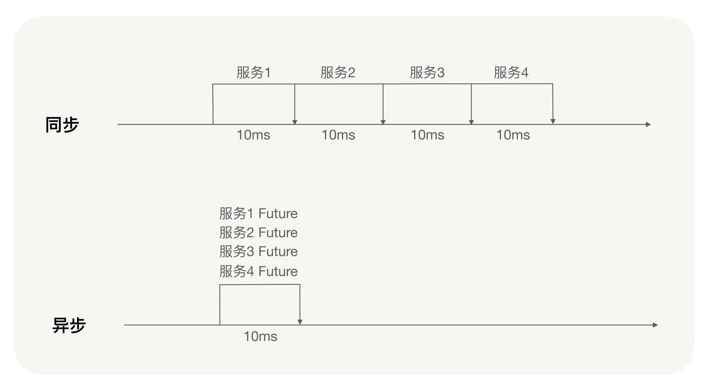

对于调用端来说，向服务端发送请求消息与接收服务端发送过来的响应消息是两个完全独立的过程，大多数情况下都不在一个线程中进行。对于RPC框架无论是同步调用还是异步调用，调用端的内部实现都是异步的。

调用端向服务端发送请求消息之前会先创建一个Future，并存储这个消息标识与Future的映射，动态代理所获得的返回值最终就是从这个Future中获取的；当收到服务端响应的消息时，调用端会根据响应消息的唯一标识找到对应的Future，将结果注入给那个Future，进行一系列的处理逻辑后动态代理从Future中获得返回值。

同步调用是RPC框架在调用端的处理逻辑中主动执行了这个Future的get方法，让动态代理等待返回值；而异步调用则是RPC框架没有主动执行这个Future的get方法，用户可以从请求上下文中得到这个Future，自己决定什么时候执行这个Future的get方法。
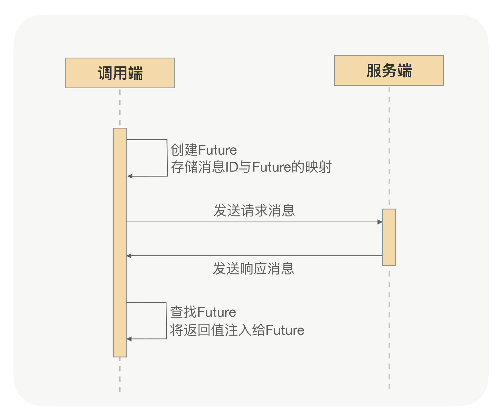

# RPC调用全异步
RPC服务端接收到请求的二进制消息之后会根据协议进行拆包解包，之后将完整的消息进行解码并反序列化，获得到入参参数之后再通过反射执行业务逻辑。

在生产环境中，对二进制消息数据包拆解包的处理是在处理网络IO的线程中。如果网络通信框架使用的是Netty框架，那么对二进制包的处理是在IO线程中，解码与反序列化的过程也大多在IO线程中处理。

业务逻辑应该交给专门的业务线程池处理，以防止由于业务逻辑处理得过慢而影响到网络IO的处理。 而业务线程池的线程数都是有限制的，一般只会配置到200，在大多数情况下线程数配置到200还不够用就说明业务逻辑该优化了。但特殊的业务场景还是会让配置的业务线程池完全打满。

RPC框架支持服务端业务逻辑异步处理，对提高服务的吞吐量有很重要的意义。服务端执行完业务逻辑之后，要对返回值进行序列化并且编码，将消息响应给调用端。

但如果是异步处理，业务逻辑触发异步之后方法就执行完了，来不及将真正的结果进行序列化并编码之后响应给调用端。因此需要RPC框架提供一种回调方式，让业务逻辑可以异步处理，处理完之后调用RPC框架的回调接口，将最终的结果通过回调的方式响应给调用端。

CompletableFuture是Java8原生支持的。如果RPC框架能够支持CompletableFuture，发布一个RPC服务，服务接口定义的返回值是CompletableFuture对象，整个调用过程会分为这样几步：

服务调用方发起RPC调用，直接拿到返回值CompletableFuture对象，之后就不需要任何额外的与RPC框架相关的操作了（如我刚才讲解Future方式时需要通过请求上下文获取Future的操作），直接就可以进行异步处理；
在服务端的业务逻辑中创建一个返回值CompletableFuture对象，之后服务端真正的业务逻辑完全可以在一个线程池中异步处理，业务逻辑完成之后再调用这个CompletableFuture对象的complete方法，完成异步通知；
调用端在收到服务端发送过来的响应之后，RPC框架再自动地调用调用端拿到的那个返回值CompletableFuture对象的complete方法，这样一次异步调用就完成了。

通过对CompletableFuture的支持，RPC框架可以真正地做到在调用端与服务端之间完全异步，同时提升了调用端与服务端的两端的单机吞吐量。

## 总结
影响RPC调用吞吐量的主要原因是服务端的业务逻辑比较耗时，并且CPU大部分时间都在等待而没有去计算，导致CPU利用率不够，而提升单机吞吐量的最好办法就是使用异步RPC。

RPC框架的异步策略主要是调用端异步与服务端异步。调用端的异步就是通过Future方式实现异步，调用端发起一次异步请求并且从请求上下文中拿到一个Future，之后通过Future的get方法获取结果，如果业务逻辑中同时调用多个其它的服务，则可以通过Future的方式减少业务逻辑的耗时，提升吞吐量。服务端异步则需要一种回调方式，让业务逻辑可以异步处理，之后调用RPC框架提供的回调接口，将最终结果异步通知给调用端。

可以通过对CompletableFuture的支持，实现RPC调用在调用端与服务端之间的完全异步，同时提升两端的单机吞吐量。

RPC框架也可以有其它的异步策略，比如集成RxJava，再比如gRPC的StreamObserver入参对象，但CompletableFuture是Java8原生提供的，无代码入侵性，并且在使用上更加方便。如果是Java开发，让RPC框架支持CompletableFuture可以说是最佳的异步解决方案。

# 安全体系
## 不经沟通就直接调用
RPC一般是服务提供方定义好一个接口，并把这个接口的Jar包发布到mvn仓库上，然后在项目中去实现这个接口，最后通过RPC提供的API把这个接口和其对应的实现类完成对外暴露。

对于服务调用方来说就更简单了，只要拿到刚才上传到mvn仓库上的Jar的坐标，就可以把发布到私服的Jar引入到项目中来，然后借助RPC提供的动态代理功能，服务调用方直接就可以在项目完成RPC调用了。

这里面存在一个安全隐患，mvn的Jar坐标所有人都可以看到，只要拿到了Jar的坐标就可以把发布到私服的Jar引入到项目中完成RPC调用。

## 方案
每个调用方设定一个唯一的身份，每个调用方在调用之前都先来服务提供方这登记下身份，只有登记过的调用方才能继续放行，没有登记过的调用方一律拒绝。

## 落地
### 授权平台
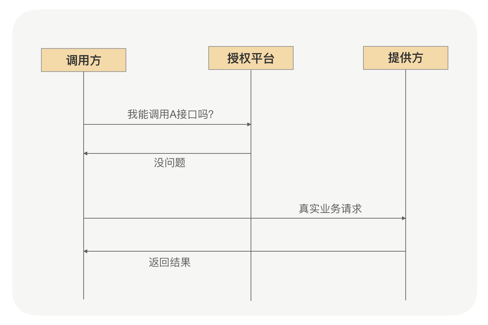
从功能的角度来说是没有问题的，整个认证过程对RPC使用者来说是透明的。问题是授权平台承担了公司内所有RPC请求的次数总和，且必须保证超高可用。一旦这个授权平台出现问题会影响全公司的RPC请求了。

### 放在服务方
调用方能不能调用相关接口由服务提供方确认。在调用方启动初始化接口的时候，带上授权平台上颁发的身份去服务提供方认证下，当认证通过后就认为这个接口可以调用。

问题在于服务提供方验证的时候对照的数据来自哪儿，如果还是请求授权平台又会遇到和前面方案一样的问题。

### 解决方案 加密算法
加密算法里面有不可逆加密算法，如HMAC就是其中一种具体实现。服务提供方应用里面放一个用于HMAC签名的私钥，在授权平台上用这个私钥为申请调用的调用方应用进行签名，这个签名生成的串就变成了调用方唯一的身份。服务提供方在收到调用方的授权请求之后，我们只要需要验证下这个签名跟调用方应用信息是否对应得上就行了，这样集中式授权的瓶颈也就不存在了。

## 服务发现
服务提供方会把接口Jar发布到私服上，以方便调用方能引入到项目中快速完成RPC调用。有可能其他人拿到你Jar后发布了一个服务提供方呢，导致调用方通过服务发现拿到的服务提供方IP地址集合里面会有那个伪造的提供方。

服务提供方启动的时候，需要把接口实例在注册中心进行注册登记。利用这个流程注册中心可以在收到服务提供方注册请求的时候，验证下请求过来的应用是否跟接口绑定的应用一样。相同才允许注册，从而避免假冒的服务提供者对外提供错误服务。

# 异常定位

分布式环境下定位问题的难点在于各个子应用、子服务间存在复杂的依赖关系，很难确定是哪个服务的哪个环节出现的问题。简单地通过日志排查问题需要对每个子应用、子服务逐一进行排查。

## 合理封装异常信息
在RPC框架打印的异常信息中，需要包含定位异常所需要的异常信息。比如具体异常类型，异常出现位置（是调用端还是服务端），调用端与服务端的IP，服务接口与服务分组等等。
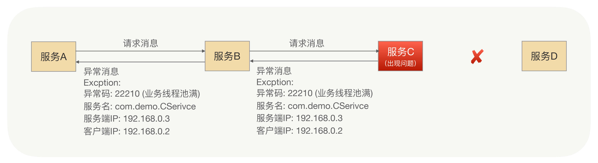

RPC框架要对异常进行详细地封装，还要对各类异常进行分类，每类异常都要有明确的异常标识码，并整理成一份简明的文档。使用方可以快速地通过异常标识码在文档中查阅，从而快速定位问题，找到原因；并且异常信息中要包含排查问题时所需要的重要信息，比如服务接口名、服务分组、调用端与服务端的IP，以及产生异常的原因。总之就是，要让使用方在复杂的分布式应用系统中，根据异常信息快速地定位到问题。

以上是对于RPC框架本身的异常来说的，比如序列化异常、响应超时异常、连接异常等等。服务提供方提供的服务的业务逻辑也要封装自己的业务异常信息，从而让服务调用方也可以通过异常信息快速地定位到问题。

## 链路跟踪
Trace代表整个调用链路，每次分布式调用都会产生一个Trace，每个Trace都有唯一标识即TraceId，分布式链路跟踪系统可以通过TraceId区分Trace。

Span代表链路中的一段，Trace是由多个Span组成。在一个Trace下，每个Span也都有它的唯一标识SpanId，而Span是存在父子关系的。还是以讲过的例子为例子，在A->B->C->D的情况下，在整个调用链中，正常情况下会产生3个Span，分别是Span1（A->B）、Span2（B->C）、Span3（C->D），这时Span3的父Span就是Span2，而Span2的父Span就是Span1。

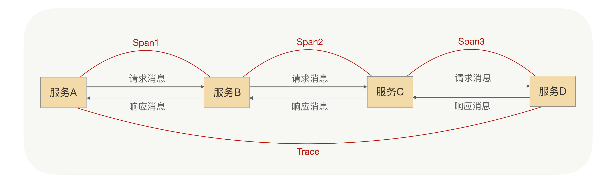

RPC在整合分布式链路跟踪需要做的最核心的两件事就是“埋点”和“传递”。

“埋点”是指分布式链路跟踪系统要想获得一次分布式调用的完整的链路信息，就必须对这次分布式调用进行数据采集，而采集这些数据的方法就是通过RPC框架对分布式链路跟踪进行埋点。

RPC调用端在访问服务端时，在发送请求消息前会触发分布式跟踪埋点，在接收到服务端响应时，也会触发分布式跟踪埋点，并且在服务端也会有类似的埋点。这些埋点最终可以记录一个完整的Span，而这个链路的源头会记录一个完整的Trace，最终Trace信息会被上报给分布式链路跟踪系统。

“传递”是指上游调用端将Trace信息与父Span信息传递给下游服务的服务端，由下游触发埋点，对这些信息进行处理，在分布式链路跟踪系统中，每个子Span都存有父Span的相关信息以及Trace的相关信息。

# 时钟轮在RPC中的应用
## 定时任务
RPC框架中处理超时请求会使用，无论是同步调用还是异步调用调用端内部实行的都是异步，而调用端在向服务端发送消息之前会创建一个Future，并存储这个消息标识与这个Future的映射。
当服务端收到消息并且处理完毕后向调用端发送响应消息，调用端在接收到消息后会根据消息的唯一标识找到这个Future，并将结果注入给这个Future。

那在这个过程中，如果服务端没有及时响应消息给调用端呢？调用端该如何处理超时的请求？

没错，就是可以利用定时任务。每次创建一个Future，我们都记录这个Future的创建时间与这个Future的超时时间，并且有一个定时任务进行检测，当这个Future到达超时时间并且没有被处理时，我们就对这个Future执行超时逻辑。

## 定时任务该如何实现

### sleep——问题 资源浪费
有种实现方式是这样的，也是最简单的一种。每创建一个Future我们都启动一个线程，之后sleep，到达超时时间就触发请求超时的处理逻辑。

这种方式吧，确实简单，在某些场景下也是可以使用的，但弊端也是显而易见的。就像刚才我讲的那个Future超时处理的例子，如果我们面临的是高并发的请求，单机每秒发送数万次请求，请求超时时间设置的是5秒，那我们要创建多少个线程用来执行超时任务呢？超过10万个线程

### 单线程扫描
可以用一个线程来处理所有的定时任务，还以刚才那个Future超时处理的例子为例。假设我们要启动一个线程，这个线程每隔100毫秒会扫描一遍所有的处理Future超时的任务，当发现一个Future超时了，我们就执行这个任务，对这个Future执行超时逻辑。

问题 浪费PCU

同样是高并发的请求，那么扫描任务的线程每隔100毫秒要扫描多少个定时任务呢？如果调用端刚好在1秒内发送了1万次请求，这1万次请求要在5秒后才会超时，那么那个扫描的线程在这个5秒内就会不停地对这1万个任务进行扫描遍历，要额外扫描40多次（每100毫秒扫描一次，5秒内要扫描近50次），很浪费CPU。

## 时钟轮
目标：减少额外的扫描操作就行了

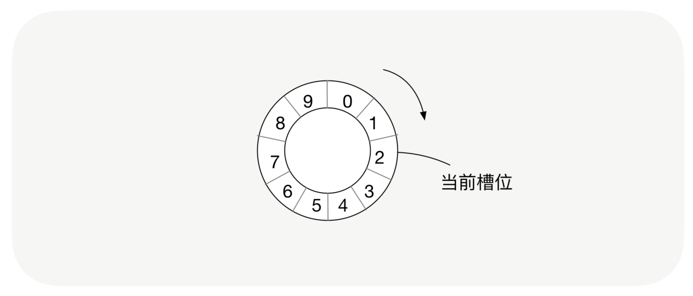

在时钟轮机制中，有时间槽和时钟轮的概念，时间槽就相当于时钟的刻度，而时钟轮就相当于秒针与分针等跳动的一个周期，我们会将每个任务放到对应的时间槽位上。

时钟轮的运行机制和生活中的时钟也是一样的，每隔固定的单位时间，就会从一个时间槽位跳到下一个时间槽位，这就相当于我们的秒针跳动了一次；时钟轮可以分为多层，下一层时钟轮中每个槽位的单位时间是当前时间轮整个周期的时间，这就相当于1分钟等于60秒钟；当时钟轮将一个周期的所有槽位都跳动完之后，就会从下一层时钟轮中取出一个槽位的任务，重新分布到当前的时钟轮中，当前时钟轮则从第0槽位从新开始跳动，这就相当于下一分钟的第1秒。

## 时钟轮在RPC中的应用

调用端请求超时处理，这里我们就可以应用到时钟轮，我们每发一次请求，都创建一个处理请求超时的定时任务放到时钟轮里，在高并发、高访问量的情况下，时钟轮每次只轮询一个时间槽位中的任务，这样会节省大量的CPU。

调用端与服务端启动超时也可以应用到时钟轮，以调用端为例，假设我们想要让应用可以快速地部署，例如1分钟内启动，如果超过1分钟则启动失败。我们可以在调用端启动时创建一个处理启动超时的定时任务，放到时钟轮里。

除此之外，你还能想到RPC框架在哪些地方可以应用到时钟轮吗？还有定时心跳。RPC框架调用端定时向服务端发送心跳，来维护连接状态，我们可以将心跳的逻辑封装为一个心跳任务，放到时钟轮里。

这时你可能会有一个疑问，心跳是要定时重复执行的，而时钟轮中的任务执行一遍就被移除了，对于这种需要重复执行的定时任务我们该如何处理呢？在定时任务的执行逻辑的最后，我们可以重设这个任务的执行时间，把它重新丢回到时钟轮里。

## 总结
在时间轮的使用中，有些问题需要你额外注意：

时间槽位的单位时间越短，时间轮触发任务的时间就越精确。例如时间槽位的单位时间是10毫秒，那么执行定时任务的时间误差就在10毫秒内，如果是100毫秒，那么误差就在100毫秒内。
时间轮的槽位越多，那么一个任务被重复扫描的概率就越小，因为只有在多层时钟轮中的任务才会被重复扫描。比如一个时间轮的槽位有1000个，一个槽位的单位时间是10毫秒，那么下一层时间轮的一个槽位的单位时间就是10秒，超过10秒的定时任务会被放到下一层时间轮中，也就是只有超过10秒的定时任务会被扫描遍历两次，但如果槽位是10个，那么超过100毫秒的任务，就会被扫描遍历两次。
结合这些特点，我们就可以视具体的业务场景而定，对时钟轮的周期和时间槽数进行设置。

在RPC框架中，只要涉及到定时任务，我们都可以应用时钟轮，比较典型的就是调用端的超时处理、调用端与服务端的启动超时以及定时心跳等等。

*问题 一个槽位内有太多任务处理不完怎么办 或者说 怎么保证同一个槽位的任务都在时间槽的时间内至少被触发了（执行是另一个线程的事情）*

可以限制一个槽位最多的任务数？然后往后顺延 crane应该就有这个机制 是否允许顺延 不允许的话就直接抛错了

# 流量回放
## 应用场景
测试

为了保障应用升级后，我们的业务行为还能保持和升级前一样，我们在大多数情况下都是依靠已有的TestCase去验证，但这种方式在一定程度上并不是完全可靠的。最可靠的方式就是引入线上Case去验证改造后的应用，把线上的真实流量在改造后的应用里面进行回放，这样不仅节省整个上线时间，还能弥补手动维护Case存在的缺陷。

应用引入了RPC后，所有的请求流量都会被RPC接管，所以我们可以很自然地在RPC里面支持流量回放功能。虽然这个功能本身并不是RPC的核心功能，但对于使用RPC的人来说，他们有了这个功能之后，就可以更放心地升级自己的应用了。

## 实现
既然所有的请求都会经过RPC，那么我们在RPC里面是不是就可以很方便地拿到每次请求的出入参数？拿到这些出入参数后，我们只要把这些出入参数旁录下来，并把这些旁录结果用异步的方式发送到一个固定的地方保存起来，这样就完成了流量回放里面的录制功能。

有了真实的请求入参之后，剩下的就是怎么把这些请求参数转发到我们要回归测试的应用里面。在RPC中，我们把能够接收请求的应用叫做服务提供方，那就是说我们只需要模拟一个应用调用方，把刚才收到的请求参数重新发送一遍到要回归测试的应用里面，然后比对录制拿到的请求结果和新请求的结果，就可以完成请求回放的效果。整个过程如下图所示：

# 动态分组：超高效实现秒级扩缩容

## 分组后容量评估
通过计算分组内所有调用方QPS的方式来算出单个分组内所需的机器数，整体而言还是比较客观准确的。但因为每个调用方的调用量并不是一成不变的，比如商家找个网红做个直播卖货，那就很有可能会导致今天的下单量相对昨天有小幅度的上涨。就是因为这些不确定性因素的存在，所以服务提供方在给调用方做容量评估的时候，通常都会在现有调用量的基础上加一个百分比，而这个百分比多半来自历史经验总结。

总之，就是在我们算每个分组所需要的机器数的时候，需要额外给每个分组增加一些机器，从而让每个小集群有一定的抗压能力，而这个抗压能力取决于给这个集群预留的机器数量。作为服务提供方来说，肯定希望给每个集群预留的机器数越多越好，但现实情况又不允许预留太多，因为这样会增加团队的整体成本。

## 分组带来的问题
通过给分组预留少量机器的方式，以增加单个集群的抗压能力。一般情况下，这种机制能够运行得很好，但在应对大的突发流量时，就会显得有点捉襟见肘了。因为机器成本的原因，我们给每个分组预留的机器数量都不会太多，所以当突发流量超过预留机器的能力的时候，就会让这个分组的集群处于一个危险状态了。

，我们在给分组做容量评估的时候，通常都会增加了一些富余。换句话就是，除了当前出问题的分组，其它分组的服务提供方在保障自己调用方质量的同时，还是可以额外承担一些流量的。我们可以想办法快速利用这部分已有的能力。

但因为我们实现了流量隔离功能，整个集群被我们划分成了不同的分组，所以当前出问题的调用方并不能把请求发送到其它分组的机器上。那可能你会说，既然临时去申请机器进行扩容时间长，那我能不能把上面说的那些富余的机器直接拿过来，把部署在机器上的应用改成出问题的分组，然后进行重启啊？这样出问题的那个分组的服务提供方机器数就会变多了。

从结果上来看，这样处理确实能够解决问题，但有一个问题就是这样处理的时间还是相对较长的，而且当这个分组的流量恢复后，你还得把临时借过来的机器还回原来的分组。

问题分析到这儿，我想说，动态分组就可以派上用场了。

## 动态分组的应用

上面的问题，其根本原因就是某个分组的调用方流量突增，而这个分组所预留的空间也不能满足当前流量的需求，但是其它分组的服务提供方有足够的富余能力。但这些富余的能力，又被我们的分组进行了强制的隔离，我们又不能抛弃分组功能，否则老问题就要循环起来了。

那这样的话，我们就只能在出问题的时候临时去借用其它分组的部分能力，但通过改分组进行重启应用的方式，不仅操作过程慢，事后还得恢复。因此这种生硬的方式显然并不是很合适。

想一下啊，我们改应用分组然后进行重启的目的，就是让出问题的服务调用方能通过服务发现找到更多的服务提供方机器，而服务发现的数据来自注册中心，那我们是不是可以通过修改注册中心的数据来解决呢？

我们只要把注册中心里面的部分实例的别名改成我们想要的别名，然后通过服务发现进而影响到不同调用方能够调用的服务提供方实例集合。

举个例子，服务提供方有3个服务实例，其中A分组有2个实例，B分组有1个实例，调用方1调用A分组，调用方2调用B分组。我们把A分组里面的一个实例分组在注册中心由A分组改为B分组，经过服务发现影响后，整个调用拓扑就变成了这样：

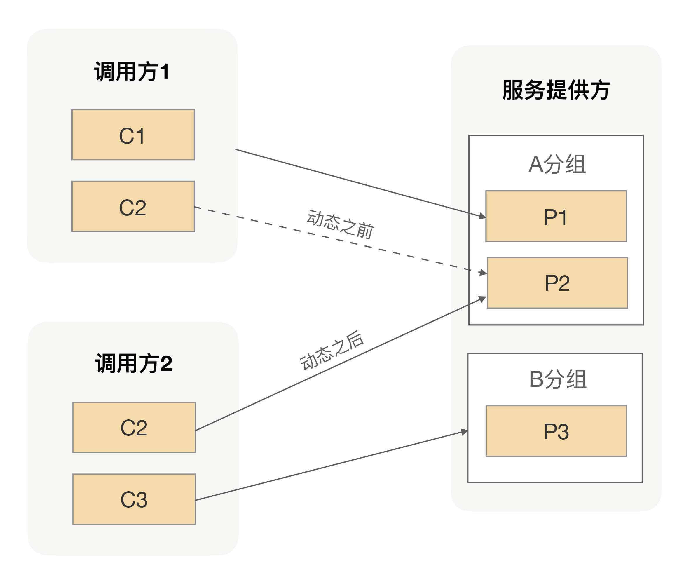

通过直接修改注册中心数据，我们可以让任何一个分组瞬间拥有不同规模的集群能力。我们不仅可以实现把某个实例的分组名改成另外一个分组名，还可以让某个实例分组名变成多个分组名，这就是我们在动态分组里面最常见的两种动作——追加和替换。

## 总结
分组后带来的收益，它可以帮助服务提供方实现调用方的隔离。但是因为调用方流量并不是一成不变的，而且还可能会因为突发事件导致某个分组的流量溢出，而在整个大集群还有富余能力的时候，又因为分组隔离不能为出问题的集群提供帮助。

为了解决这种突发流量的问题，我们提供了一种更高效的方案，可以实现分组的快速扩缩容。事实上我们还可以利用动态分组解决分组后给每个分组预留机器冗余的问题，我们没有必要把所有冗余的机器都分配到分组里面，我们可以把这些预留的机器做成一个共享的池子，从而减少整体预留的实例数量。

# 泛化调用
## 应用场景
1. 测试平台
我们要搭建一个统一的测试平台，可以让各个业务方在测试平台中通过输入接口、分组名、方法名以及参数值，在线测试自己发布的RPC服务。这时我们就有一个问题要解决，我们搭建统一的测试平台实际上是作为各个RPC服务的调用端，而在RPC框架的使用中，调用端是需要依赖服务提供方提供的接口API的，而统一测试平台不可能依赖所有服务提供方的接口API。我们不能因为每有一个新的服务发布，就去修改平台的代码以及重新上线。这时我们就需要让调用端在没有服务提供方提供接口的情况下，仍然可以正常地发起RPC调用。

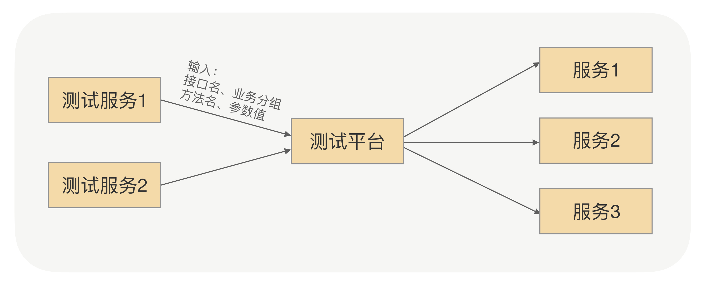

## 网关
我们要搭建一个轻量级的服务网关，可以让各个业务方用HTTP的方式，通过服务网关调用其它服务。这时就有与场景一相同的问题，服务网关要作为所有RPC服务的调用端，是不能依赖所有服务提供方的接口API的，也需要调用端在没有服务提供方提供接口的情况下，仍然可以正常地发起RPC调用。

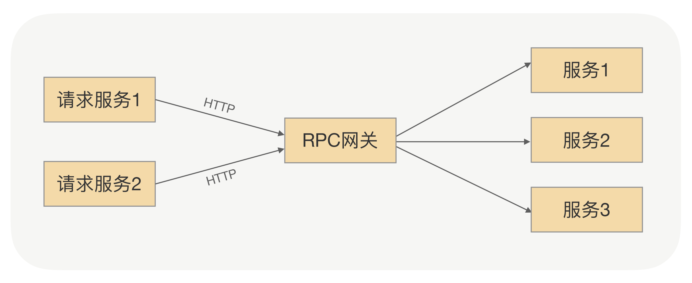

## 泛化调用
RPC调用的过程中，调用端向服务端发起请求，首先要通过动态代理，正如[第 05 讲] 中我说过的，动态代理可以帮助我们屏蔽RPC处理流程，真正地让我们发起远程调用就像调用本地一样。

那么在RPC调用的过程中，既然调用端是通过动态代理向服务端发起远程调用的，那么在调用端的程序中就一定要依赖服务提供方提供的接口API，因为调用端是通过这个接口API自动生成动态代理的。那如果没有接口API呢？我们该如何让调用端仍然能够发起RPC调用呢？

所谓的RPC调用，本质上就是调用端向服务端发送一条请求消息，服务端接收并处理，之后向调用端发送一条响应消息，调用端处理完响应消息之后，一次RPC调用就完成了。那是不是说我们只要能够让调用端在没有服务提供方提供接口的情况下，仍然能够向服务端发送正确的请求消息，就能够解决这个问题了呢？

没错，只要调用端将服务端需要知道的信息，如接口名、业务分组名、方法名以及参数信息等封装成请求消息发送给服务端，服务端就能够解析并处理这条请求消息，这样问题就解决了。过程如下图所示：

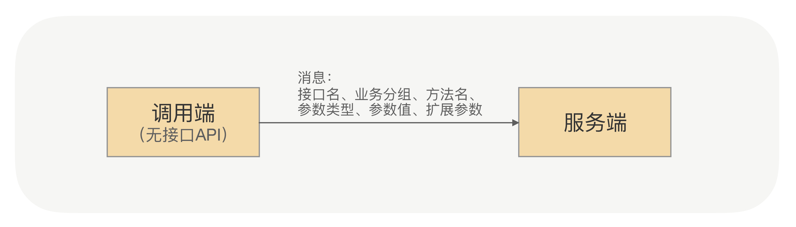

# 协议兼容

## 应用场景
既然应用之间的通信都是通过RPC来完成的，而能够完成RPC通信的工具有很多，比如像Web Service、Hessian、gRPC等都可以用来充当RPC使用。这些不同的RPC框架都是随着互联网技术的发展而慢慢涌现出来的，而这些RPC框架可能在不同时期会被我们引入到不同的项目中解决当时应用之间的通信问题，这样就导致我们线上的生成环境中存在各种各样的RPC框架。

很显然，这种混乱使用RPC框架的方式肯定不利于公司技术栈的管理，最明显的一个特点就是我们维护RPC框架的成本越来越高，因为每种RPC框架都需要有专人去负责升级维护。

为了解决早期遗留的一些技术负债，我们通常会去选择更高级的、更好用的工具来解决，治理RPC框架混乱的问题也是一样。为了解决同时维护多个RPC框架的困难，我们肯定希望能够用统一用一种RPC框架来替代线上所有的RPC框架，这样不仅能降低我们的维护成本，而且还可以让我们在一种RPC上面去精进。

## 处理方案
协议的作用就是用于分割二进制数据流。每种协议约定的数据包格式是不一样的，而且每种协议开头都有一个协议编码，我们一般叫做magic number。

当RPC收到了数据包后，我们可以先解析出magic number来。获取到magic number后，我们就很容易地找到对应协议的数据格式，然后用对应协议的数据格式去解析收到的二进制数据包。

协议解析过程就是把一连串的二进制数据变成一个RPC内部对象，但这个对象一般是跟协议相关的，所以为了能让RPC内部处理起来更加方便，我们一般都会把这个协议相关的对象转成一个跟协议无关的RPC对象。这是因为在RPC流程中，当服务提供方收到反序列化后的请求的时候，我们需要根据当前请求的参数找到对应接口的实现类去完成真正的方法调用。如果这个请求参数是跟协议相关的话，那后续RPC的整个处理逻辑就会变得很复杂。

当完成了真正的方法调用以后，RPC返回的也是一个跟协议无关的通用对象，所以在真正往调用方写回数据的时候，我们同样需要完成一个对象转换的逻辑，只不过这时候是把通用对象转成协议相关的对象。

在收发数据包的时候，我们通过两次转换实现RPC内部的处理逻辑跟协议无关，同时保证调用方收到的数据格式跟调用请求过来的数据格式是一样的。
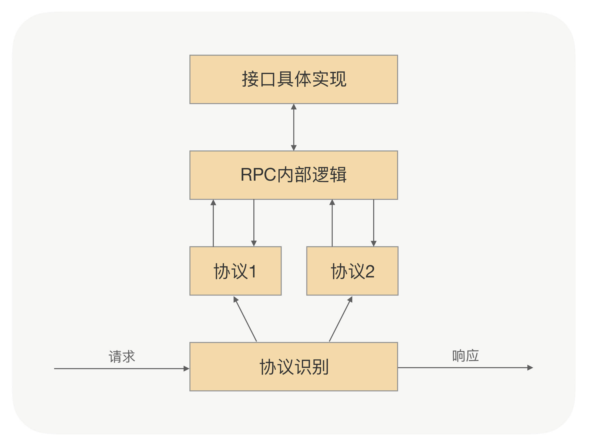

## 总结
日常开发的过程中，最难的环节不是从0到1完成一个新应用的开发，而是把一个老应用通过架构升级完成从70分到80分的跳跃。因为在老应用升级的过程中，我们不仅需要考虑既有的功能逻辑，也需要考虑切换到新架构上的成本，这就要求我们在设计新架构的时候要考虑如何让老应用能够平滑地升级，就像在RPC里面支持多协议一样。

在RPC里面支持多协议，不仅能让我们更从容地推进应用RPC的升级，还能为未来在RPC里面扩展新协议奠定一个良好的基础。所以我们平时在设计应用架构的时候，不仅要考虑应用自身功能的完整性，还需要考虑应用的可运维性，以及是否能平滑升级等一些软性能力。