# RPC架构
说起架构设计，我相信你一定不陌生。我理解的架构设计呢，就是从顶层角度出发，厘清各模块组件之间数据交互的流程，让我们对系统有一个整体的宏观认识。我们先看看RPC里面都有哪些功能模块。

我们讲过，RPC本质上就是一个远程调用，那肯定就需要通过网络来传输数据。虽然传输协议可以有多种选择，但考虑到可靠性的话，我们一般默认采用TCP协议。为了屏蔽网络传输的复杂性，我们需要封装一个单独的数据传输模块用来收发二进制数据，这个单独模块我们可以叫做传输模块。

用户请求的时候是基于方法调用，方法出入参数都是对象数据，对象是肯定没法直接在网络中传输的，我们需要提前把它转成可传输的二进制，这就是我们说的序列化过程。但只是把方法调用参数的二进制数据传输到服务提供方是不够的，我们需要在方法调用参数的二进制数据后面增加“断句”符号来分隔出不同的请求，在两个“断句”符号中间放的内容就是我们请求的二进制数据，这个过程我们叫做协议封装。

虽然这是两个不同的过程，但其目的都是一样的，都是为了保证数据在网络中可以正确传输。这里我说的正确，可不仅指数据能够传输，还需要保证传输后能正确还原出传输前的语义。所以我们可以把这两个处理过程放在架构中的同一个模块，统称为协议模块。

除此之外，我们还可以在协议模块中加入压缩功能，这是因为压缩过程也是对传输的二进制数据进行操作。在实际的网络传输过程中，我们的请求数据包在数据链路层可能会因为太大而被拆分成多个数据包进行传输，为了减少被拆分的次数，从而导致整个传输过程时间太长的问题，我们可以在RPC调用的时候这样操作：在方法调用参数或者返回值的二进制数据大于某个阈值的情况下，我们可以通过压缩框架进行无损压缩，然后在另外一端也用同样的压缩算法进行解压，保证数据可还原。

传输和协议这两个模块是RPC里面最基础的功能，它们使对象可以正确地传输到服务提供方。但距离RPC的目标——实现像调用本地一样地调用远程，还缺少点东西。因为这两个模块所提供的都是一些基础能力，要让这两个模块同时工作的话，我们需要手写一些黏合的代码，但这些代码对我们使用RPC的研发人员来说是没有意义的，而且属于一个重复的工作，会导致使用过程的体验非常不友好。

这就需要我们在RPC里面把这些细节对研发人员进行屏蔽，让他们感觉不到本地调用和远程调用的区别。假设有用到Spring的话，我们希望RPC能让我们把一个RPC接口定义成一个Spring Bean，并且这个Bean也会统一被Spring Bean Factory管理，可以在项目中通过Spring依赖注入到方式引用。这是RPC调用的入口，我们一般叫做Bootstrap模块。

学到这儿，一个点对点（Point to Point）版本的RPC框架就完成了。我一般称这种模式的RPC框架为单机版本，因为它没有集群能力。所谓集群能力，就是针对同一个接口有着多个服务提供者，但这多个服务提供者对于我们的调用方来说是透明的，所以在RPC里面我们还需要给调用方找到所有的服务提供方，并需要在RPC里面维护好接口跟服务提供者地址的关系，这样调用方在发起请求的时候才能快速地找到对应的接收地址，这就是我们常说的“服务发现”。

但服务发现只是解决了接口和服务提供方地址映射关系的查找问题，这更多是一种“静态数据”。说它是静态数据是因为，对于我们的RPC来说，我们每次发送请求的时候都是需要用TCP连接的，相对服务提供方IP地址，TCP连接状态是瞬息万变的，所以我们的RPC框架里面要有连接管理器去维护TCP连接的状态。

有了集群之后，提供方可能就需要管理好这些服务了，那我们的RPC就需要内置一些服务治理的功能，比如服务提供方权重的设置、调用授权等一些常规治理手段。而服务调用方需要额外做哪些事情呢？每次调用前，我们都需要根据服务提供方设置的规则，从集群中选择可用的连接用于发送请求。

那到这儿，一个比较完善的RPC框架基本就完成了，功能也差不多就是这些了。按照分层设计的原则，我将这些功能模块分为了四层，具体内容见图示：

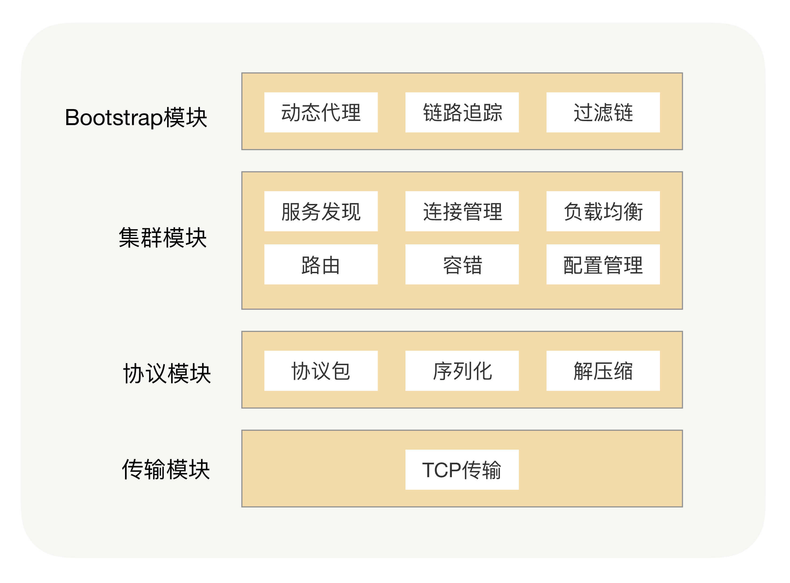

## 可扩展的架构【没明白 怎么做到的...】
我们是怎么支持插件化架构的呢？我们可以将每个功能点抽象成一个接口，将这个接口作为插件的契约，然后把这个功能的接口与功能的实现分离，并提供接口的默认实现。在Java里面，JDK有自带的SPI（Service Provider Interface）服务发现机制，它可以动态地为某个接口寻找服务实现。使用SPI机制需要在Classpath下的META-INF/services目录里创建一个以服务接口命名的文件，这个文件里的内容就是这个接口的具体实现类。

但在实际项目中，我们其实很少使用到JDK自带的SPI机制，首先它不能按需加载，ServiceLoader加载某个接口实现类的时候，会遍历全部获取，也就是接口的实现类得全部载入并实例化一遍，会造成不必要的浪费。另外就是扩展如果依赖其它的扩展，那就做不到自动注入和装配，这就很难和其他框架集成，比如扩展里面依赖了一个Spring Bean，原生的Java SPI就不支持。

加上了插件功能之后，我们的RPC框架就包含了两大核心体系——核心功能体系与插件体系，如下图所示：

这时，整个架构就变成了一个微内核架构，我们将每个功能点抽象成一个接口，将这个接口作为插件的契约，然后把这个功能的接口与功能的实现分离并提供接口的默认实现。这样的架构相比之前的架构，有很多优势。首先它的可扩展性很好，实现了开闭原则，用户可以非常方便地通过插件扩展实现自己的功能，而且不需要修改核心功能的本身；其次就是保持了核心包的精简，依赖外部包少，这样可以有效减少开发人员引入RPC导致的包版本冲突问题。

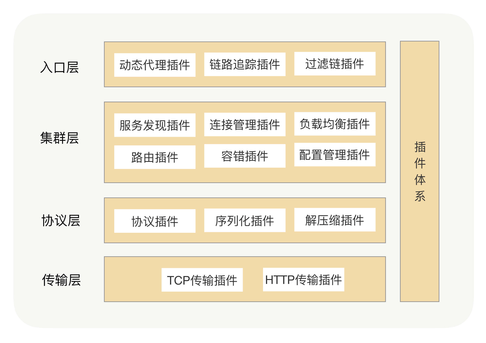

# 服务发现
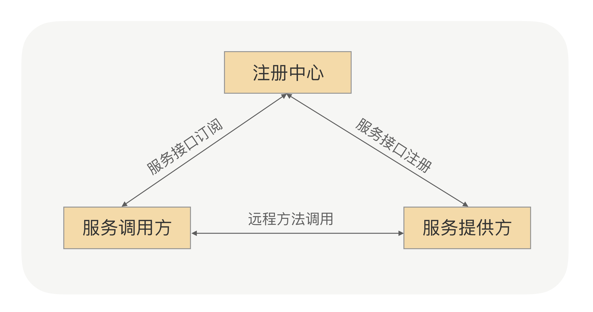
服务注册：在服务提供方启动的时候，将对外暴露的接口注册到注册中心之中，注册中心将这个服务节点的IP和接口保存下来。
服务订阅：在服务调用方启动的时候，去注册中心查找并订阅服务提供方的IP，然后缓存到本地，并用于后续的远程调用。

## DNS
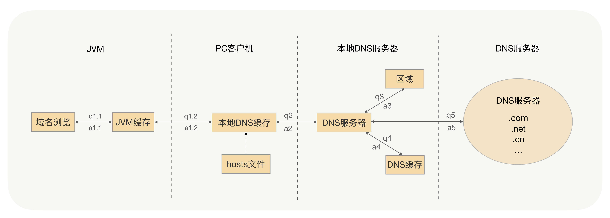
如果这个IP端口下线了，服务调用者能否及时摘除服务节点呢？
如果在之前已经上线了一部分服务节点，这时我突然对这个服务进行扩容，那么新上线的服务节点能否及时接收到流量呢？
这两个问题的答案都是：“不能”。这是因为为了提升性能和减少DNS服务的压力，DNS采取了多级缓存机制，一般配置的缓存时间较长，特别是JVM的默认缓存是永久有效的，所以说服务调用者不能及时感知到服务节点的变化。

## DNS+负载均衡
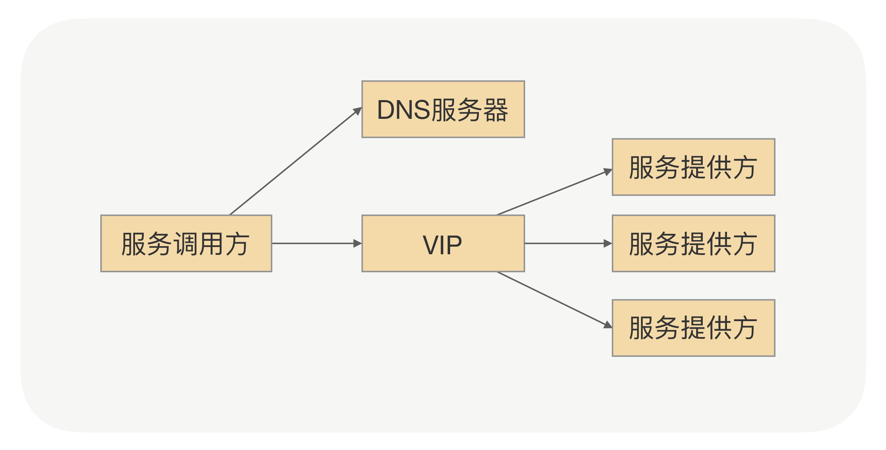
这个方案确实能解决DNS遇到的一些问题，但在RPC场景里面也并不是很合适，原因有以下几点：

- 搭建负载均衡设备或TCP/IP四层代理，需求额外成本；
- 请求流量都经过负载均衡设备，多经过一次网络传输，会额外浪费些性能；
- 负载均衡添加节点和摘除节点，一般都要手动添加，当大批量扩容和下线时，会有大量的人工操作和生效延迟；
- 我们在服务治理的时候，需要更灵活的负载均衡策略，目前的负载均衡设备的算法还满足不了灵活的需求。
由此可见，DNS或者VIP方案虽然可以充当服务发现的角色，但在RPC场景里面直接用还是很难的。

## 基于ZooKeeper的服务发现
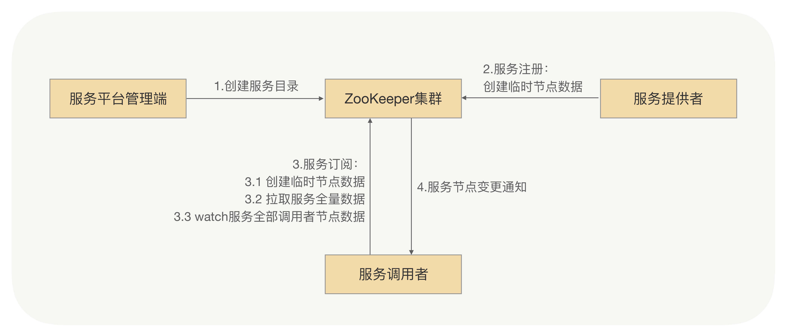
1. 服务平台管理端先在ZooKeeper中创建一个服务根路径，可以根据接口名命名（例如：/service/com.demo.xxService），在这个路径再创建服务提供方目录与服务调用方目录（例如：provider、consumer），分别用来存储服务提供方的节点信息和服务调用方的节点信息。
2. 当服务提供方发起注册时，会在服务提供方目录中创建一个临时节点，节点中存储该服务提供方的注册信息。
3. 当服务调用方发起订阅时，则在服务调用方目录中创建一个临时节点，节点中存储该服务调用方的信息，同时服务调用方watch该服务的服务提供方目录（/service/com.demo.xxService/provider）中所有的服务节点数据。
4. 当服务提供方目录下有节点数据发生变更时，ZooKeeper就会通知给发起订阅的服务调用方。

### 缺点
我所在的技术团队早期使用的RPC框架服务发现就是基于ZooKeeper实现的，并且还平稳运行了一年多，但后续团队的微服务化程度越来越高之后，ZooKeeper集群整体压力也越来越高，尤其在集中上线的时候越发明显。“集中爆发”是在一次大规模上线的时候，当时有超大批量的服务节点在同时发起注册操作，ZooKeeper集群的CPU突然飙升，导致ZooKeeper集群不能工作了，而且我们当时也无法立马将ZooKeeper集群重新启动，一直到ZooKeeper集群恢复后业务才能继续上线。

经过我们的排查，引发这次问题的根本原因就是ZooKeeper本身的性能问题，当连接到ZooKeeper的节点数量特别多，对ZooKeeper读写特别频繁，且ZooKeeper存储的目录达到一定数量的时候，ZooKeeper将不再稳定，CPU持续升高，最终宕机。而宕机之后，由于各业务的节点还在持续发送读写请求，刚一启动，ZooKeeper就因无法承受瞬间的读写压力，马上宕机。

这次“意外”让我们意识到，ZooKeeper集群性能显然已经无法支撑我们现有规模的服务集群了，我们需要重新考虑服务发现方案。

## 基于消息总线的最终一致性的注册中心
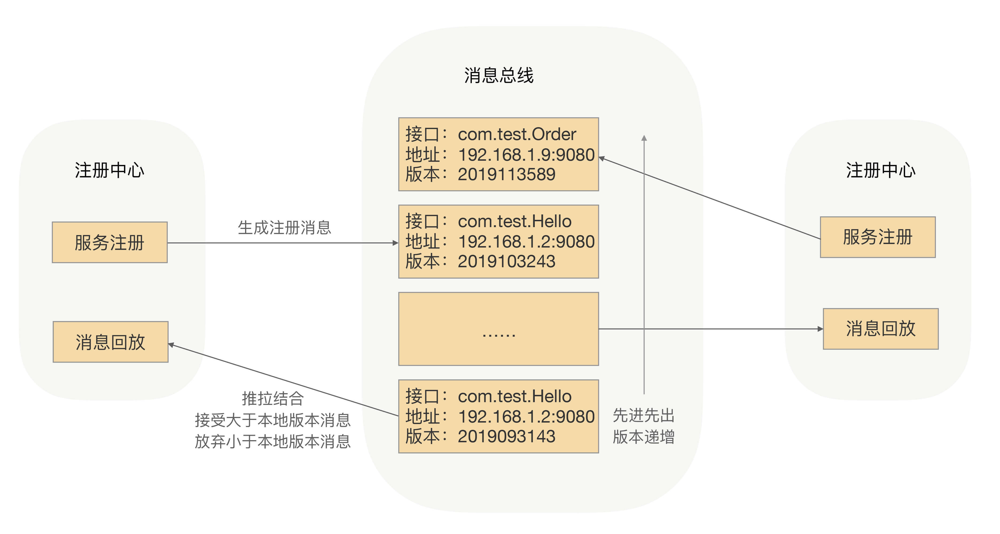

当有服务上线，注册中心节点收到注册请求，服务列表数据发生变化，会生成一个消息，推送给消息总线，每个消息都有整体递增的版本。
消息总线会主动推送消息到各个注册中心，同时注册中心也会定时拉取消息。对于获取到消息的在消息回放模块里面回放，只接受大于本地版本号的消息，小于本地版本号的消息直接丢弃，从而实现最终一致性。
消费者订阅可以从注册中心内存拿到指定接口的全部服务实例，并缓存到消费者的内存里面。
采用推拉模式，消费者可以及时地拿到服务实例增量变化情况，并和内存中的缓存数据进行合并。
为了性能，这里采用了两级缓存，注册中心和消费者的内存缓存，通过异步推拉模式来确保最终一致性。

服务调用方拿到的服务节点不是最新的，所以目标节点存在已经下线或不提供指定接口服务的情况，这个时候有没有问题？这个问题我们放到了RPC框架里面去处理，在服务调用方发送请求到目标节点后，目标节点会进行合法性验证，如果指定接口服务不存在或正在下线，则会拒绝该请求。服务调用方收到拒绝异常后，会安全重试到其它节点。

“推拉结合，以拉为准”

# 健康检测
调用方跟服务集群节点之间的网络状况是瞬息万变的，两者之间可能会出现闪断或者网络设备损坏等情况，那怎么保证选择出来的连接一定是可用的呢？

终极的解决方案是让调用方实时感知到节点的状态变化

有了对这四个线索的分析，我基本上可以得出这样的结论：那台问题服务器在某些时间段出现了网络故障，但也还能处理部分请求。换句话说，它处于半死不活的状态。但是（是转折，也是关键点），它还没彻底“死”，还有心跳，这样，调用方就觉得它还正常，所以就没有把它及时挪出健康状态列表。

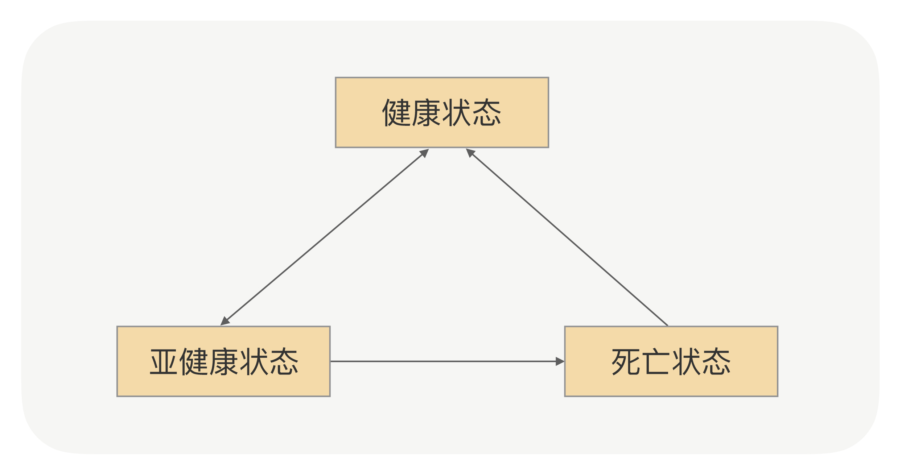
健康状态：建立连接成功，并且心跳探活也一直成功；
亚健康状态：建立连接成功，但是心跳请求连续失败；
死亡状态：建立连接失败。

，节点的心跳日志只是间歇性失败，也就是时好时坏，这样，失败次数根本没到阈值，调用方会觉得它只是“生病”了，并且很快就好了。那怎么解决呢？我还是建议你先停下来想想。

你是不是会脱口而出，说改下配置，调低阈值呗。是的，这是最快的解决方法，但是我想说，它治标不治本。第一，像前面说的那样，调用方跟服务节点之间网络状况瞬息万变，出现网络波动的时候会导致误判。第二，在负载高情况，服务端来不及处理心跳请求，由于心跳时间很短，会导致调用方很快触发连续心跳失败而造成断开连接。
我们回到问题的本源，核心是服务节点网络有问题，心跳间歇性失败。我们现在判断节点状态只有一个维度，那就是心跳检测，那是不是可以再加上业务请求的维度呢？

起码我当时是顺着这个方向解决问题的。但紧接着，我又发现了新的麻烦：

调用方每个接口的调用频次不一样，有的接口可能1秒内调用上百次，有的接口可能半个小时才会调用一次，所以我们不能把简单的把总失败的次数当作判断条件。
服务的接口响应时间也是不一样的，有的接口可能1ms，有的接口可能是10s，所以我们也不能把TPS至来当作判断条件。
和同事讨论之后，我们找到了可用率这个突破口，应该相对完美了。可用率的计算方式是某一个时间窗口内接口调用成功次数的百分比（成功次数/总调用次数）。当可用率低于某个比例就认为这个节点存在问题，把它挪到亚健康列表，这样既考虑了高低频的调用接口，也兼顾了接口响应时间不同的问题。

# 路由策略
既然服务提供方是以集群的方式对外提供服务，那就要考虑一些实际问题。要知道我们每次上线应用的时候都不止一台服务器会运行实例，那上线就涉及到变更，只要变更就可能导致原本正常运行的程序出现异常，尤其是发生重大变动的时候，导致我们应用不稳定的因素就变得很多。

为了减少这种风险，我们一般会选择灰度发布我们的应用实例，比如我们可以先发布少量实例观察是否有异常，后续再根据观察的情况，选择发布更多实例还是回滚已经上线的实例。

## 实现路由策略
### 指定IP调用
新上线的节点只允许某个IP可以调用，那我们的注册中心会把这条规则下发到服务调用方。在调用方收到规则后，在选择具体要发请求的节点前，会先通过筛选规则过滤节点集合，按照这个例子的逻辑，最后会过滤出一个节点，这个节点就是我们刚才新上线的节点。通过这样的改造，RPC调用流程就变成了这样：

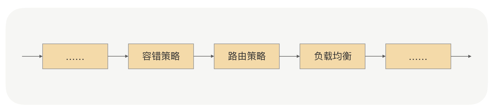
这个筛选过程在我们的RPC里面有一个专业名词，就是“路由策略”，而上面例子里面的路由策略是我们常见的IP路由策略，用于限制可以调用服务提供方的IP。使用了IP路由策略后，整个集群的调用拓扑如下图所示：

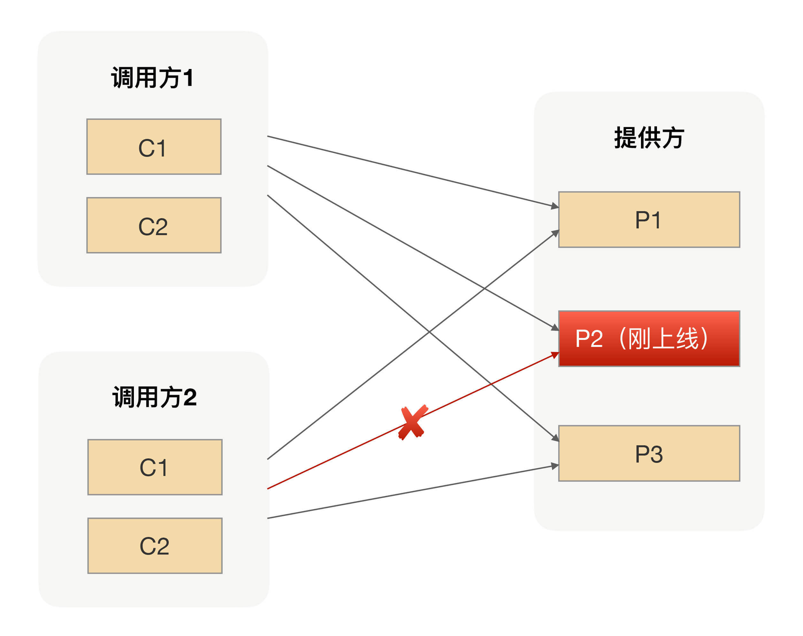
### 参数路由
给所有的服务提供方节点都打上标签，用来区分新老应用节点。在服务调用方发生请求的时候，我们可以很容易地拿到请求参数，也就是我们例子中的商品ID，我们可以根据注册中心下发的规则来判断当前商品ID的请求是过滤掉新应用还是老应用的节点。因为规则对所有的调用方都是一样的，从而保证对应同一个商品ID的请求要么是新应用的节点，要么是老应用的节点。使用了参数路由策略后，整个集群的调用拓扑如下图所示：

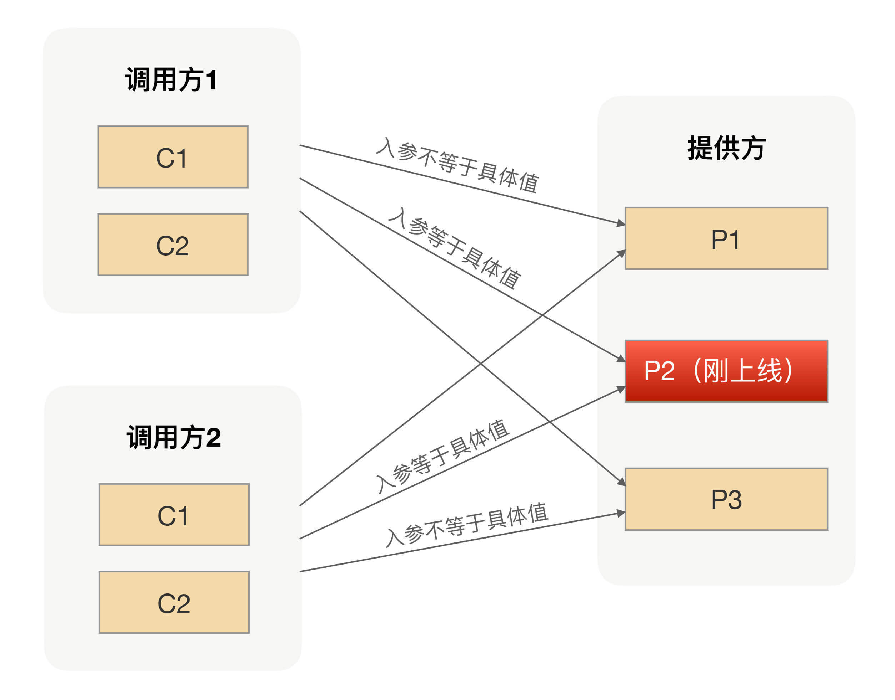

# 负载均衡
他们反馈的问题是这样的：有一次碰上流量高峰，他们突然发现线上服务的可用率降低了，经过排查发现，是因为其中有几台机器比较旧了。当时最早申请的一批容器配置比较低，缩容的时候留下了几台，当流量达到高峰时，这几台容器由于负载太高，就扛不住压力了。业务问我们有没有好的服务治理策略？

这个问题其实挺好解决的，我们当时给出的方案是：在治理平台上调低这几台机器的权重，这样的话，访问的流量自然就减少了。

但业务接着反馈了，说：当他们发现服务可用率降低的时候，业务请求已经受到影响了，这时再如此解决，需要时间啊，那这段时间里业务可能已经有损失了。紧接着他们就提出了需求，问：RPC框架有没有什么智能负载的机制？能否及时地自动控制服务节点接收到的访问量？

## 概念
负载均衡主要分为软负载和硬负载，软负载就是在一台或多台服务器上安装负载均衡的软件，如LVS、Nginx等，硬负载就是通过硬件设备来实现的负载均衡，如F5服务器等。负载均衡的算法主要有随机法、轮询法、最小连接法等。

## RPC框架中的负载均衡
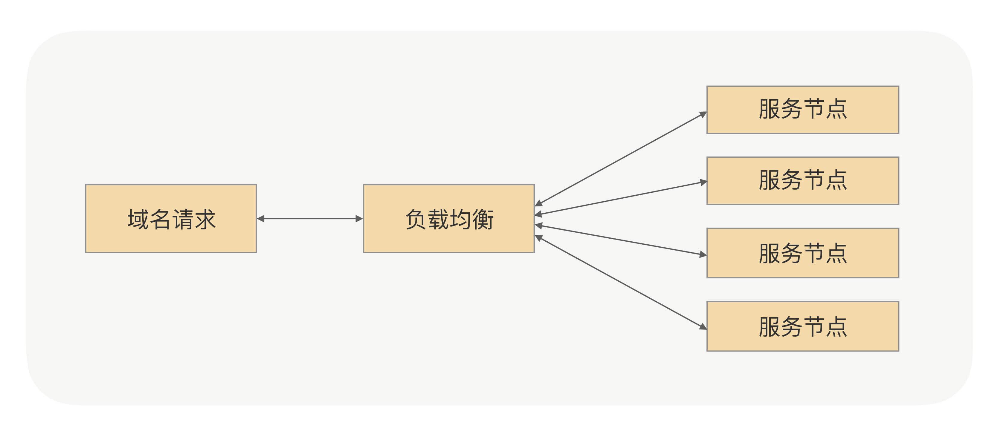
请求流量都经过负载均衡设备，多经过一次网络传输，会额外浪费一些性能；
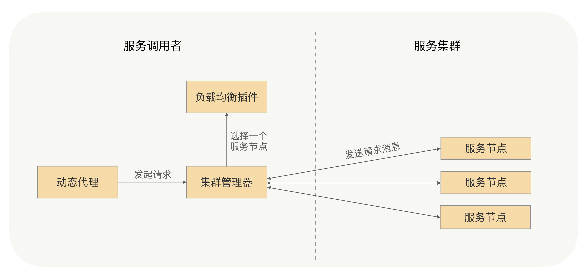
RPC的负载均衡完全由RPC框架自身实现，RPC的服务调用者会与“注册中心”下发的所有服务节点建立长连接，在每次发起RPC调用时，服务调用者都会通过配置的负载均衡插件，自主选择一个服务节点，发起RPC调用请求。

RPC负载均衡策略一般包括随机权重、Hash、轮询。当然，这还是主要看RPC框架自身的实现。其中的随机权重策略应该是我们最常用的一种了，通过随机算法，我们基本可以保证每个节点接收到的请求流量是均匀的；同时我们还可以通过控制节点权重的方式，来进行流量控制。比如我们默认每个节点的权重都是100，但当我们把其中的一个节点的权重设置成50时，它接收到的流量就是其他节点的1/2。

## 自适应的负载均衡
调用者知道每个服务节点处理请求的能力，再根据服务处理节点处理请求的能力来判断要打给它多少流量就可以了？当一个服务节点负载过高或响应过慢时，就少给它发送请求，反之则多给它发送请求。

### 那服务调用者节点又该如何判定一个服务节点的处理能力呢？

这里我们可以采用一种打分的策略，服务调用者收集与之建立长连接的每个服务节点的指标数据，如服务节点的负载指标、CPU核数、内存大小、请求处理的耗时指标（如请求平均耗时、TP99、TP999）、服务节点的状态指标（如正常、亚健康）。通过这些指标，计算出一个分数，比如总分10分，如果CPU负载达到70%，就减它3分

### 根据这些指标来打分呢？
    
我们可以为每个指标都设置一个指标权重占比，然后再根据这些指标数据，计算分数。
    
### 控制流量
我们可以配合随机权重的负载均衡策略去控制，通过最终的指标分数修改服务节点最终的权重。例如给一个服务节点综合打分是8分（满分10分），服务节点的权重是100，那么计算后最终权重就是80（100*80%）。服务调用者发送请求时，会通过随机权重的策略来选择服务节点，那么这个节点接收到的流量就是其他正常节点的80%（这里假设其他节点默认权重都是100，且指标正常，打分为10分的情况）。

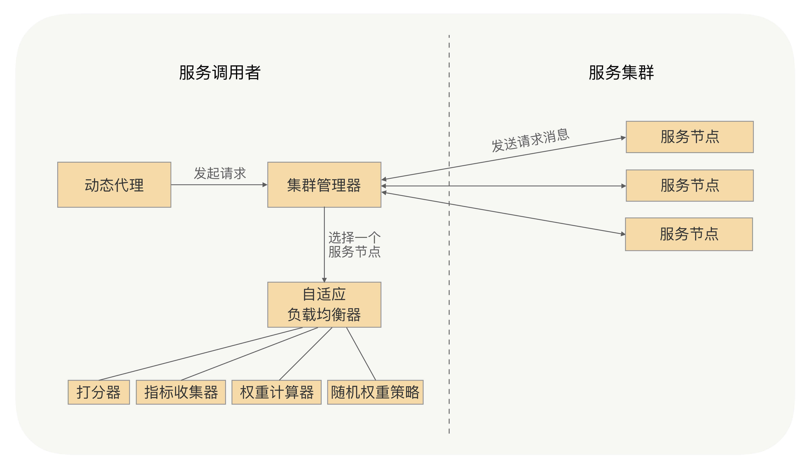

关键步骤：
添加服务指标收集器，并将其作为插件，默认有运行时状态指标收集器、请求耗时指标收集器。
运行时状态指标收集器收集服务节点CPU核数、CPU负载以及内存等指标，在服务调用者与服务提供者的心跳数据中获取。
请求耗时指标收集器收集请求耗时数据，如平均耗时、TP99、TP999等。
可以配置开启哪些指标收集器，并设置这些参考指标的指标权重，再根据指标数据和指标权重来综合打分。
通过服务节点的综合打分与节点的权重，最终计算出节点的最终权重，之后服务调用者会根据随机权重的策略，来选择服务节点。

# 异常重试
幂等操作才能重试
在使用RPC框架的时候，我们要确保被调用的服务的业务逻辑是幂等的，这样我们才能考虑根据事件情况开启RPC框架的异常重试功能。

## 时间控制
连续的异常重试可能会出现一种不可靠的情况，那就是连续的异常重试并且每次处理的请求时间比较长，最终会导致请求处理的时间过长，超出用户设置的超时时间。

解决这个问题最直接的方式就是，在每次重试后都重置一下请求的超时时间。

## 节点选择
我们需要在所有发起重试、负载均衡选择节点的时候，去掉重试之前出现过问题的那个节点，以保证重试的成功率。

当调用端设置了异常重试策略，发起了一次RPC调用，通过负载均衡选择了节点，将请求消息发送到这个节点，这时这个节点由于负载压力较大，导致这个请求处理失败了，调用端触发了重试，再次通过负载均衡选择了一个节点，结果恰好仍选择了这个节点，那么在这种情况下，重试的效果是否受影响了呢？

## 重试异常白名单
比如这个场景：服务端的业务逻辑是对数据库某个数据的更新操作，更新失败则抛出个更新失败的异常，调用端可以再次调用，来触发服务端重新执行更新操作。那这个时候对于调用端来说，它接收到了更新失败异常，虽然是服务端抛回来的业务异常，但也是可以进行重试的。

RPC框架是不会知道哪些业务异常能够去进行异常重试的，我们可以加个重试异常的白名单，用户可以将允许重试的异常加入到这个白名单中。当调用端发起调用，并且配置了异常重试策略，捕获到异常之后，我们就可以采用这样的异常处理策略。如果这个异常是RPC框架允许重试的异常，或者这个异常类型存在于可重试异常的白名单中，我们就允许对这个请求进行重试。

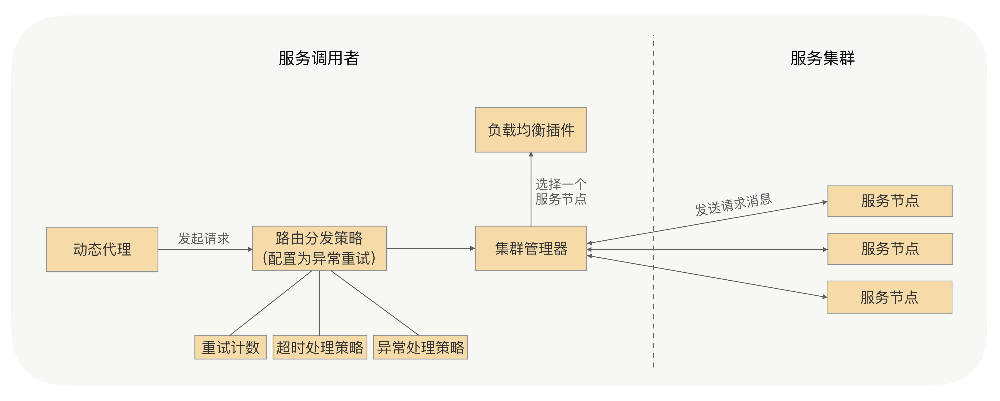
这个机制是当调用端发起的请求失败时，如果配置了异常重试策略，RPC框架会捕捉异常，对异常进行判定，符合条件则进行重试，重新发送请求。

在重试的过程中，为了能够在约定的时间内进行安全可靠地重试，在每次触发重试之前，我们需要先判定下这个请求是否已经超时，如果超时了会直接返回超时异常，否则我们需要重置下这个请求的超时时间，防止因多次重试导致这个请求的处理时间超过用户配置的超时时间，从而影响到业务处理的耗时。

在发起重试、负载均衡选择节点的时候，我们应该去掉重试之前出现过问题的那个节点，这样可以提高重试的成功率，并且我们允许用户配置可重试异常的白名单，这样可以让RPC框架的异常重试功能变得更加友好。

另外，在使用RPC框架的重试机制时，我们要确保被调用的服务的业务逻辑是幂等的，这样才能考虑是否使用重试，这一点至关重要。

# 优雅关闭
在重启服务的过程中，RPC怎么做到让调用方系统不出问题呢

> 先通知注册中心进行下线，然后通过注册中心告诉调用方进行节点摘除

整个关闭过程中依赖了两次RPC调用，一次是服务提供方通知注册中心下线操作，一次是注册中心通知服务调用方下线节点操作。注册中心通知服务调用方都是异步的，我们在“服务发现”一讲中讲过在大规模集群里面，服务发现只保证最终一致性，并不保证实时性，所以注册中心在收到服务提供方下线的时候，并不能成功保证把这次要下线的节点推送到所有的调用方。所以这么来看，通过服务发现并不能做到应用无损关闭。

不能强依赖“服务发现”来通知调用方要下线的机器，那服务提供方自己来通知行不行？因为在RPC里面调用方跟服务提供方之间是长连接，我们可以在提供方应用内存里面维护一份调用方连接集合，当服务要关闭的时候，挨个去通知调用方去下线这台机器。这样整个调用链路就变短了，对于每个调用方来说就一次RPC，可以确保调用的成功率很高。大部分场景下，这么做确实没有问题，我们之前也是这么实现的，但是我们发现线上还是会偶尔会出现，因为服务提供方上线而导致调用失败的问题。

线上还是会偶尔会出现，因为服务提供方下线而导致调用失败的问题。我后面分析了调用方请求日志跟收到关闭通知的日志，并且发现了一个线索如下：出问题请求的时间点跟收到服务提供方关闭通知的时间点很接近，只比关闭通知的时间早不到1ms，如果再加上网络传输时间的话，那服务提供方收到请求的时候，它应该正在处理关闭逻辑。这就说明服务提供方关闭的时候，并没有正确处理关闭后接收到的新请求。

因为服务提供方已经开始进入关闭流程，那么很多对象就可能已经被销毁了，关闭后再收到的请求按照正常业务请求来处理，肯定是没法保证能处理的。所以我们可以在关闭的时候，设置一个请求“挡板”，挡板的作用就是告诉调用方，我已经开始进入关闭流程了，我不能再处理你这个请求了。

基于这个思路，我们可以这么处理：当服务提供方正在关闭，如果这之后还收到了新的业务请求，服务提供方直接返回一个特定的异常给调用方（比如ShutdownException）。这个异常就是告诉调用方“我已经收到这个请求了，但是我正在关闭，并没有处理这个请求”，然后调用方收到这个异常响应后，RPC框架把这个节点从健康列表挪出，并把请求自动重试到其他节点，因为这个请求是没有被服务提供方处理过，所以可以安全地重试到其他节点，这样就可以实现对业务无损。

但如果只是靠等待被动调用，就会让这个关闭过程整体有点漫长。因为有的调用方那个时刻没有业务请求，就不能及时地通知调用方了，所以我们可以加上主动通知流程，这样既可以保证实时性，也可以避免通知失败的情况。

说到这里，我知道你肯定会问，那要怎么捕获到关闭事件呢？

在我的经验里，可以通过捕获操作系统的进程信号来获取，在Java语言里面，对应的是Runtime.addShutdownHook方法，可以注册关闭的钩子。在RPC启动的时候，我们提前注册关闭钩子，并在里面添加了两个处理程序，一个负责开启关闭标识，一个负责安全关闭服务对象，服务对象在关闭的时候会通知调用方下线节点。同时需要在我们调用链里面加上挡板处理器，当新的请求来的时候，会判断关闭标识，如果正在关闭，则抛出特定异常。

看到这里，感觉问题已经比较好地被解决了。但细心的同学可能还会提出问题，关闭过程中已经在处理的请求会不会受到影响呢？

如果进程结束过快会造成这些请求还没有来得及应答，同时调用方会也会抛出异常。为了尽可能地完成正在处理的请求，首先我们要把这些请求识别出来。这就好比日常生活中，我们经常看见停车场指示牌上提示还有多少剩余车位，这个是如何做到的呢？如果仔细观察一下，你就会发现它是每进入一辆车，剩余车位就减一，每出来一辆车，剩余车位就加一。我们也可以利用这个原理在服务对象加上引用计数器，每开始处理请求之前加一，完成请求处理减一，通过该计数器我们就可以快速判断是否有正在处理的请求。

服务对象在关闭过程中，会拒绝新的请求，同时根据引用计数器等待正在处理的请求全部结束之后才会真正关闭。但考虑到有些业务请求可能处理时间长，或者存在被挂住的情况，为了避免一直等待造成应用无法正常退出，我们可以在整个ShutdownHook里面，加上超时时间控制，当超过了指定时间没有结束，则强制退出应用。超时时间我建议可以设定成10s，基本可以确保请求都处理完了。整个流程如下图所示。

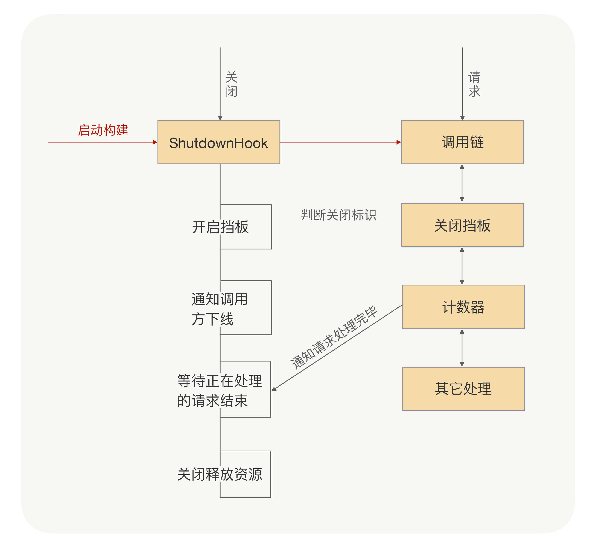

# 优雅开启
## 启动预热

让刚启动的服务提供方应用不承担全部的流量，而是让它被调用的次数随着时间的移动慢慢增加，最终让流量缓和地增加到跟已经运行一段时间后的水平一样。

### 方案
我们现在是要控制调用方发送到服务提供方的流量。我们可以先简单地回顾下调用方发起的RPC调用流程是怎样的，调用方应用通过服务发现能够获取到服务提供方的IP地址，然后每次发送请求前，都需要通过负载均衡算法从连接池中选择一个可用连接。那这样的话，我们是不是就可以让负载均衡在选择连接的时候，区分一下是否是刚启动不久的应用？对于刚启动的应用，我们可以让它被选择到的概率特别低，但这个概率会随着时间的推移慢慢变大，从而实现一个动态增加流量的过程。

### 实现
首先对于调用方来说，我们要知道服务提供方启动的时间，这个怎么获取呢？我这里给出两种方法，一种是服务提供方在启动的时候，把自己启动的时间告诉注册中心；另外一种就是注册中心收到的服务提供方的请求注册时间。

我们该怎么确保所有机器的日期时间是一样的？这其实不用太关心，因为整个预热过程的时间是一个粗略值，即使机器之间的日期时间存在1分钟的误差也不影响，并且在真实环境中机器都会默认开启NTP时间同步功能，来保证所有机器时间的一致性。

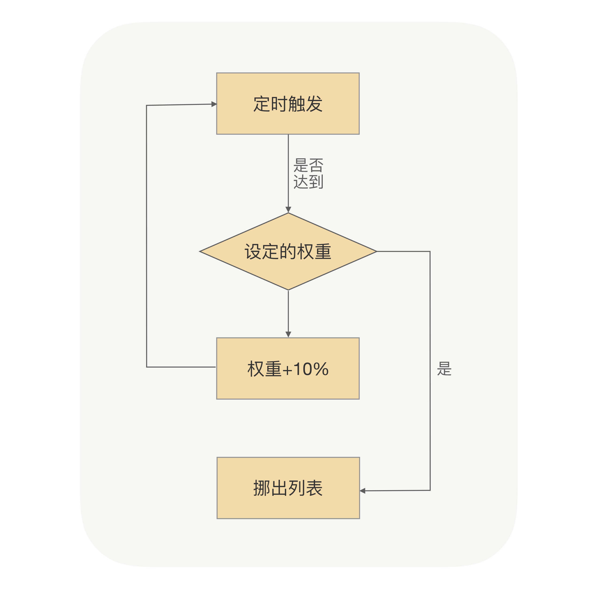

## 延迟暴露
### 问题
Spring容器会顺序加载Spring Bean，如果某个Bean是RPC服务的话，我们不光要把它注册到Spring-BeanFactory里面去，还要把这个Bean对应的接口注册到注册中心。注册中心在收到新上线的服务提供方地址的时候，会把这个地址推送到调用方应用内存中；当调用方收到这个服务提供方地址的时候，就会去建立连接发请求。

但这时候是不是存在服务提供方可能并没有启动完成的情况？因为服务提供方应用可能还在加载其它的Bean。对于调用方来说，只要获取到了服务提供方的IP，就有可能发起RPC调用，但如果这时候服务提供方没有启动完成的话，就会导致调用失败，从而使业务受损。

### 方案
把接口注册到注册中心的时间挪到应用启动完成后。具体的做法就是在应用启动加载、解析Bean的时候，如果遇到了RPC服务的Bean，只先把这个Bean注册到Spring-BeanFactory里面去，而并不把这个Bean对应的接口注册到注册中心，只有等应用启动完成后，才把接口注册到注册中心用于服务发现，从而实现让服务调用方延迟获取到服务提供方地址。

这样是可以保证应用在启动完后才开始接入流量的，但其实这样做，我们还是没有实现最开始的目标。因为这时候应用虽然启动完成了，但并没有执行相关的业务代码，所以JVM内存里面还是冷的。如果这时候大量请求过来，还是会导致整个应用在高负载模式下运行，从而导致不能及时地返回请求结果。而且在实际业务中，一个服务的内部业务逻辑一般会依赖其它资源的，比如缓存数据。如果我们能在服务正式提供服务前，先完成缓存的初始化操作，而不是等请求来了之后才去加载，我们就可以降低重启后第一次请求出错的概率。

## 实现
我们还是需要利用服务提供方把接口注册到注册中心的那段时间。我们可以在服务提供方应用启动后，接口注册到注册中心前，预留一个Hook过程，让用户可以实现可扩展的Hook逻辑。用户可以在Hook里面模拟调用逻辑，从而使JVM指令能够预热起来，并且用户也可以在Hook里面事先预加载一些资源，只有等所有的资源都加载完成后，最后才把接口注册到注册中心。

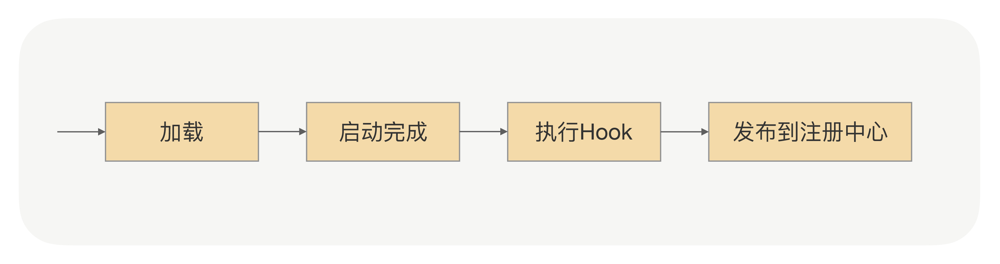

# 熔断限流
## 服务端的自我保护（限流）
一个RPC服务，作为服务端接收调用端发送过来的请求，这时服务端的某个节点负载压力过高了，我们该如何保护这个节点

负载压力高，那就不让它再接收太多的请求就好了，等接收和处理的请求数量下来后，这个节点的负载压力自然就下来了。

限流是一个比较通用的功能，我们可以在RPC框架中集成限流的功能，让使用方自己去配置限流阈值；我们还可以在服务端添加限流逻辑，当调用端发送请求过来时，服务端在执行业务逻辑之前先执行限流逻辑，如果发现访问量过大并且超出了限流的阈值，就让服务端直接抛回给调用端一个限流异常，否则就执行正常的业务逻辑。

*问题：RPC是多对多直连的，怎么搞的集群限流 以及，如果尝试了1，2，3，4，5台机子都抛出限流错误是否会导致RPC请求时间损耗*

## 集群非精确限流（利用单机限流）
方式有很多，比如最简单的计数器，还有可以做到平滑限流的滑动窗口、漏斗算法以及令牌桶算法等等。其中令牌桶算法最为常用。上述这几种限流算法我就不一一讲解了，资料很多，不太清楚的话自行查阅下就可以了。

我们可以假设下这样一个场景：我发布了一个服务，提供给多个应用的调用方去调用，这时有一个应用的调用方发送过来的请求流量要比其它的应用大很多，这时我们就应该对这个应用下的调用端发送过来的请求流量进行限流。所以说我们在做限流的时候要考虑应用级别的维度，甚至是IP级别的维度，这样做不仅可以让我们对一个应用下的调用端发送过来的请求流量做限流，还可以对一个IP发送过来的请求流量做限流。

这时你可能会想，使用方该如何配置应用维度以及IP维度的限流呢？在代码中配置是不是不大方便？我之前说过，RPC框架真正强大的地方在于它的治理功能，而治理功能大多都需要依赖一个注册中心或者配置中心，我们可以通过RPC治理的管理端进行配置，再通过注册中心或者配置中心将限流阈值的配置下发到服务提供方的每个节点上，实现动态配置。

看到这儿，你有没有发现，在服务端实现限流，配置的限流阈值是作用在每个服务节点上的。比如说我配置的阈值是每秒1000次请求，那么就是指一台机器每秒处理1000次请求；如果我的服务集群拥有10个服务节点，那么我提供的服务限流阈值在最理想的情况下就是每秒10000次。

接着看这样一个场景：我提供了一个服务，而这个服务的业务逻辑依赖的是MySQL数据库，由于MySQL数据库的性能限制，我们是需要对其进行保护。假如在MySQL处理业务逻辑中，SQL语句的能力是每秒10000次，那么我们提供的服务处理的访问量就不能超过每秒10000次，而我们的服务有10个节点，这时我们配置的限流阈值应该是每秒1000次。那如果之后因为某种需求我们对这个服务扩容了呢？扩容到20个节点，我们是不是就要把限流阈值调整到每秒500次呢？这样操作每次都要自己去计算，重新配置，显然太麻烦了。

我们可以让RPC框架自己去计算，当注册中心或配置中心将限流阈值配置下发的时候，我们可以将总服务节点数也下发给服务节点，之后由服务节点自己计算限流阈值，这样就解决问题了吧？

## 集群精确限流
解决了一部分，还有一个问题存在，那就是在实际情况下，一个服务节点所接收到的访问量并不是绝对均匀的，比如有20个节点，而每个节点限流的阈值是500，其中有的节点访问量已经达到阈值了，但有的节点可能在这一秒内的访问量是450，这时调用端发送过来的总调用量还没有达到10000次，但可能也会被限流，这样是不是就不精确了？那有没有比较精确的限流方式呢？

我刚才讲解的限流方式之所以不精确，是因为限流逻辑是服务集群下的每个节点独立去执行的，是一种单机的限流方式，而且每个服务节点所接收到的流量并不是绝对均匀的。

我们可以提供一个专门的限流服务，让每个节点都依赖一个限流服务，当请求流量打过来时，服务节点触发限流逻辑，调用这个限流服务来判断是否到达了限流阈值。我们甚至可以将限流逻辑放在调用端，调用端在发出请求时先触发限流逻辑，调用限流服务，如果请求量已经到达了限流阈值，请求都不需要发出去，直接返回给动态代理一个限流异常即可。

这种限流方式可以让整个服务集群的限流变得更加精确，但也由于依赖了一个限流服务，它在性能和耗时上与单机的限流方式相比是有很大劣势的。至于要选择哪种限流方式，就要结合具体的应用场景进行选择了。

## 调用端的自我保护（熔断）
### 机制
熔断器的工作机制主要是关闭、打开和半打开这三个状态之间的切换。在正常情况下，熔断器是关闭的；当调用端调用下游服务出现异常时，熔断器会收集异常指标信息进行计算，当达到熔断条件时熔断器打开，这时调用端再发起请求是会直接被熔断器拦截，并快速地执行失败逻辑；当熔断器打开一段时间后，会转为半打开状态，这时熔断器允许调用端发送一个请求给服务端，如果这次请求能够正常地得到服务端的响应，则将状态置为关闭状态，否则设置为打开。

有没有想到在哪个步骤整合熔断器会比较合适呢？

我的建议是动态代理，因为在RPC调用的流程中，动态代理是RPC调用的第一个关口。在发出请求时先经过熔断器，如果状态是闭合则正常发出请求，如果状态是打开则执行熔断器的失败策略。

## 总结
服务端主要是通过限流来进行自我保护，我们在实现限流时要考虑到应用和IP级别，方便我们在服务治理的时候，对部分访问量特别大的应用进行合理的限流；服务端的限流阈值配置都是作用于单机的，而在有些场景下，例如对整个服务设置限流阈值，服务进行扩容时，限流的配置并不方便，我们可以在注册中心或配置中心下发限流阈值配置的时候，将总服务节点数也下发给服务节点，让RPC框架自己去计算限流阈值；我们还可以让RPC框架的限流模块依赖一个专门的限流服务，对服务设置限流阈值进行精准地控制，但是这种方式依赖了限流服务，相比单机的限流方式，在性能和耗时上有劣势。

调用端可以通过熔断机制进行自我保护，防止调用下游服务出现异常，或者耗时过长影响调用端的业务逻辑，RPC框架可以在动态代理的逻辑中去整合熔断器，实现RPC框架的熔断功能。

# 流量隔离
## 为什么需要分组
其中一个调用方的流量突然激增，让你整个集群瞬间处于高负载运行，进而影响到其它调用方，导致它们的整体可用率下降。
## 如何实现
服务调用方是通过接口名去注册中心找到所有的服务节点来完成服务发现的。为了实现分组隔离逻辑，我们需要重新改造下服务发现的逻辑，调用方去获取服务节点的时候除了要带着接口名，还需要另外加一个分组参数，相应的服务提供方在注册的时候也要带上分组参数。

*问题 这里是所有节点和分组信息全下发给调用方，在调用方区分可以调用哪些提供方 还是在下发时就只下发调用方可用的提供方*

非核心应用不要跟核心应用分在同一个组，核心应用之间应该做好隔离，一个重要的原则就是保障核心应用不受影响。

## 如何实现高可用
分组隔离后，单个调用方在发RPC请求的时候可选择的服务节点数相比没有分组前减少了，那对于单个调用方来说，出错的概率就升高了。比如一个集中交换机设备突然坏了，而这个调用方的所有服务节点都在这个交换机下面，在这种情况下对于服务调用方来说，它的请求无论如何也到达不了服务提供方，从而导致这个调用方业务受损。

调用方应用服务发现的时候，除了带上对应的接口名，还需要带上一个特定分组名，所以对于调用方来说，它是拿不到其它分组的服务节点的

还需要把配置的分组区分下主次分组，只有在主分组上的节点都不可用的情况下才去选择次分组节点；只要主分组里面的节点恢复正常，我们就必须把流量都切换到主节点上，整个切换过程对于应用层完全透明，从而在一定程度上保障调用方应用的高可用。

*问题 主节点只剩一个可用，全都打到这一个节点么 反而会把所有主节点打崩 然后切到次节点 部分主节点恢复 都打主节点 主节点崩溃 是个循环...*

