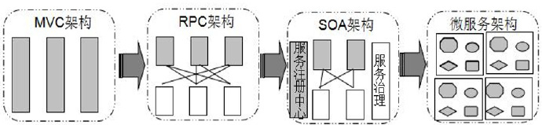
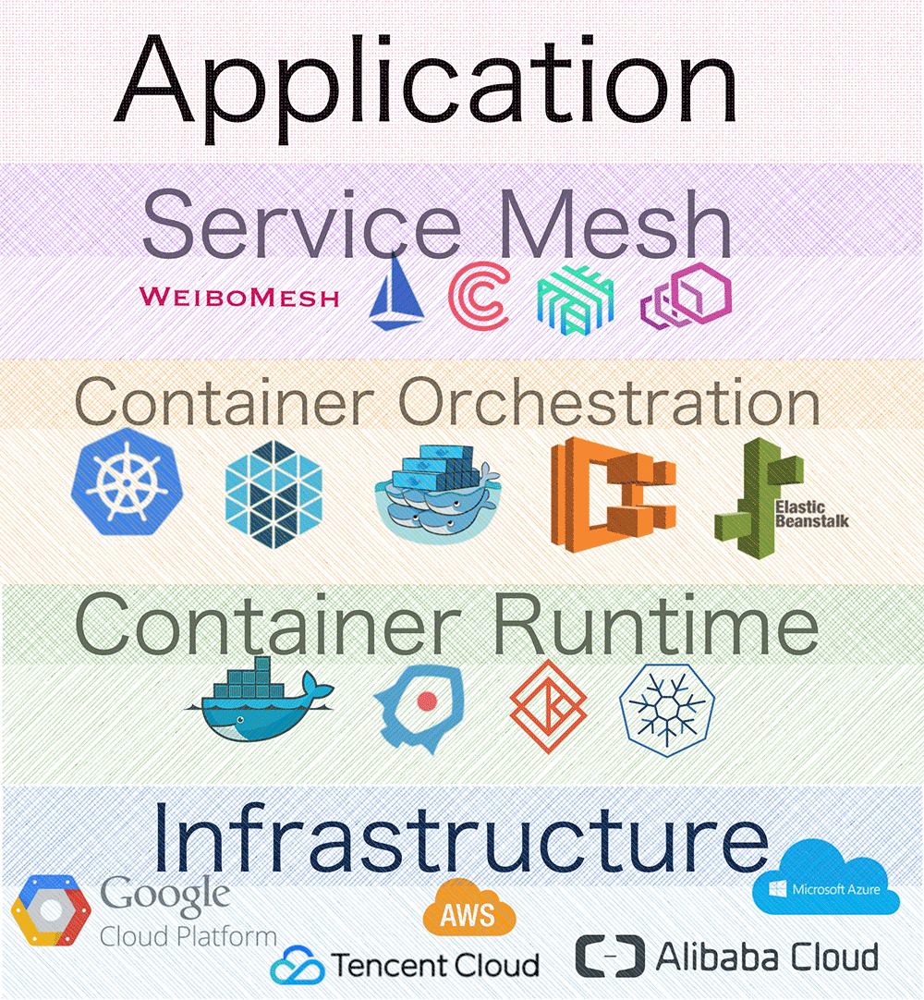
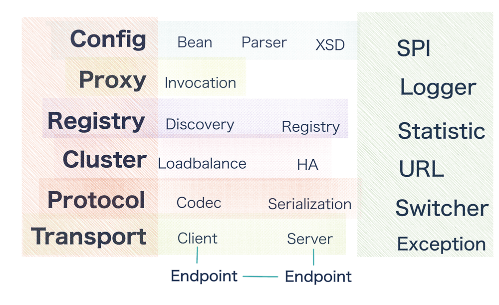
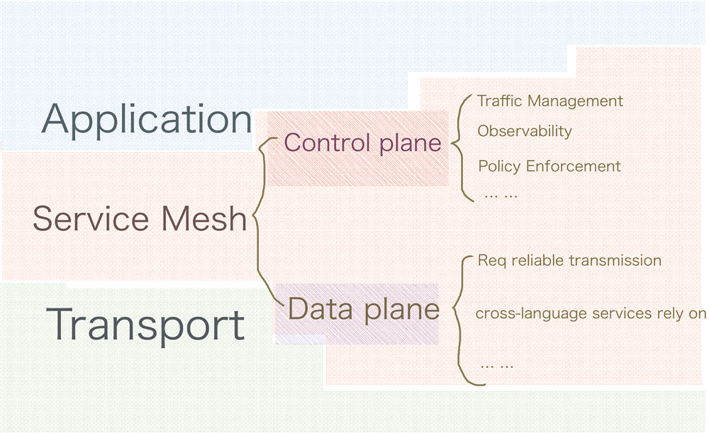

Service Mesh 是一个基础设施层，用于处理服务间通信。云原生应用有着复杂的服务拓扑，Service Mesh 保证请求可以在这些拓扑中可靠地穿梭。在实际应用当中，Service Mesh
通常是由一系列轻量级的网络代理组成的，它们与应用程序部署在一起，但应用程序不需要知道它们的存在。

关于这个定义有以下两个值得我们关注的核心点：

Service Mesh 是一个专门负责请求可靠传输的基础设施层； Service Mesh 的实现为一组同应用部署在一起并且对应用透明的轻量网络代理。

结合前面的定义，用一句话总结：服务治理和请求可靠传输就是 Service Mesh 这个基础设施层的职能边界。

为了保证项目能快速成型并上线，起初的应用可能是一个大一统的单体服务，所有业务逻辑、数据层依赖等都在一个项目中完成，这么做的好处在于：开发独立、快速，利用资源合理，服务调用更直接、性能更高等等。

但缺点也不少，最致命的问题就是耦合，而且随着业务的不断堆叠这种耦合会越来越严重，项目越来越臃肿。

所以下一步通常都会往模块化的服务演进，比如 MVC 模式的使用、RPC 技术的引入等，主要解决业务或者功能模块之间耦合的问题。

随着业务量的增长和组织的扩大，性能和扩展性将是不得不面对的大问题，所以通常会按照 SOA 的思路进行面向服务的体系结构拆分。

随着云化技术的发展，容器技术的普及，考虑到集群的弹性运维以及业务运营维护成本、业务运营演进效率等问题，微服务架构就显得更贴近现实。

1. 业务初期：单体架构 发展初期，用户规模高速增长，伴随而来的还有不断涌现的新业务，因为你不知道哪个今天还名不见经传的业务明天就会摇身一变成为备受瞩目的核心业务，大家就像在白纸上疯狂试错。这个时候，快速开发上线才是当务之急。

为了达成这个目标，我们对整个系统做了优良的模块化设计，每个业务作为一个独立的模块，保障业务能独立开发、发布并快速上线。 同时我们自研了容器框架
Cedrus，并在接入层实现了一些通用的逻辑，比如提供统一的认证、频次控制、黑白名单、降级开关、配置服务等功能。平台服务内部则通过 Jar 包的方式依赖调用，对外暴露 API 接口。

在部署方面，我们采用大服务池整体部署的方案，这样一来我们可以更合理地利用资源，避免为每个项目每个模块单独配置资源。

这种单体架构的好处在于资源利用更合理，通过 Jar 包应用来完成的本地服务调用不仅更直接，性能也更高，模块之间开发也相互独立，很多通用的前置逻辑被统一剥离出来后，业务的同学只需要关注自己的逻辑实现就可以了。

当然，单体架构的缺点也很突出，最主要的就是耦合。项目之间强耦合带来了一系列问题，比如升级困难，回归测试非常难做，以及随着业务模块的增多，模块之间的依赖解决困难等问题，此外还有各种 Jar
包冲突，越往后功能越加臃肿，业务变更十分吃力。这时候，就必须考虑做拆分了。

2. 业务稳定期：服务化改造 希望通过架构改造来达到保证服务高可用的同时实现业务解耦的目的，以便更好地支撑业务发展。
   主要从业务模块拆分方面来考虑，基于我们之前模块化的单体应用架构，按业务模块拆分是最自然也最容易想到的方案。我们只需要把以往基于 Jar 包依赖的大一统平台按照业务模块做拆分然后独立部署，即可达到业务解耦的目的。

3. RPC 服务化 拆分之后服务之间依赖的问题如何解决？我们当时面临两种选择，一种是提供 HTTP 的 RESTful 接口，一种是使用 RPC 提供远端过程调用。

RESTful 接口的好处在于 HTTP 是明文协议，开发调试比较方便，RESTful 接口描述也足够简单。但缺点也很突出，HTTP 协议本身比较臃肿，我们内部服务的依赖主要解决数据可靠性传输的问题，并不需要那么多无用的请求头。

相比之下， RPC 具有可编程特性，可以根据微博的业务特性定制化开发。同时，因为使用私有协议，所以能大大减小每个请求的体量，这对内部服务动辄过亿的依赖调用来说，能节省不少专线带宽，同时能收获更高的访问性能。所以我们决定采用 RPC
的方式来解耦服务间依赖。

4. 容器化、混合云架构 大量按业务拆分的服务独立部署使得服务的扩缩容操作缓慢，直接拉低了峰值流量的应对能力。

正好这个时候， Docker 提出的一整套围绕容器部署和管理相关的生态系统逐渐完善，于是微博率先在重点业务上尝试了容器化。

与此同时，虚拟化、云计算领域也在飞速发展。为了低成本高效率地应对各种极端峰值，我们在容器化的基础上探索了公有云和私有云混合部署的模式，研发了微博 DCP 混合云平台，实现了资源的动态扩缩容，结合 Motan RPC
的服务治理实现了对流量的弹性调度。

5. 跨语言服务化之路 【TODO】 异构系统一般通过 RESTful 接口进行交互。由于每个团队的服务部署都不尽相同，依赖的服务访问往往要经过层层转发，此过程中繁重的网络 I/O
   拖长了请求耗时，影响了系统性能同时也使得问题排查变得更复杂。另外，每种语言都有一套自己的系统或者指标，这也带来了许多不必要的重复资源浪费。

6. 从跨语言服务化到 Service Mesh

抛开大 PB 反序列化带来的性能损失，类似 PHP 这种原生没有常驻内存控制能力的语言，实现服务治理都会面临同样的问题，就算能很自然地实现服务治理功能，难道需要每种语言都实现一套重复的服务治理功能吗？显然不是这样的。

所以我们就希望引入一个 Agent，来统一解决服务治理的问题，Client 只需要实现 Motan 协议解析，直接通过本机 Agent 调用远端服务即可。这便是 WeiboMesh 的雏形，也就是目前被大家所熟知的 SideCar
模式代理的 Service Mesh 实现。

## Service Mesh 是什么，搞清楚 Service Mesh 解决问题的边界

Service Mesh 是什么？这个词最早是由开发 Linkerd 的 Buoyant 公司提出，Linkerd 的 CEO William 最早给出定义：服务网格（Service
Mesh）是一个基础设施层，功能在于处理服务间通信，职责是负责实现请求的可靠传递。在实践中，服务网格通常实现为轻量级网络代理，与应用程序部署在一起，但是对应用程序透明。

我们在解决跨语言服务化中服务间调用和统一服务治理所引入的 Agent 就是这个 Mesh 层。虽然 Service Mesh
是个新词，但它描述的问题却是一个固有问题，微服务发展到一定阶段，当服务间的调用、依赖、服务治理复杂到一定程度后，都会面临这个问题。所以 Service Mesh 是服务化必经之路，这就是为什么我们的跨语言服务化最终会落脚到
WeiboMesh。

我们基于 Motan-go 实现了客户端服务端的双向代理，基于微博注册中心 Vintage 实现了对 Agent 的动态指令控制，完成了传输与控制的重新定义，并结合 OpenDCP 平台实现了动态流量调度和弹性扩缩容，保障了服务的高可用。

# 跨语言&serviceMesh的关系

你可能会问，这里不是在讨论 WeiboMesh 吗？为什么一直扯着跨语言不放？因为在微博场景下，异构系统间服务的通信都是基于语言中立的 HTTP 协议实现 RESTful 接口来完成的，而除此之外微博平台内部还有大量的 RPC
服务也希望能直接暴露给业务方，而不用在前面又包装一层 RESTful 接口。 Service Mesh 刻画的是一个语言中立的通信和控制层，介于应用层和传输层之间 通信协议（比如
gRPC、thrift）解决的是服务调用的问题，以哪种协议封包传输，关注协议的结构及传输、解包效率。

序列化协议则关注相关协议是否为一种语言无关的协议（比如 gRPC 使用的 PB 序列化协议），或者如果是跨语言协议的话，是否对跨语言足够友好，支持足够多的语言数据类型，更多的语言原生的数据结构。

这就是为什么需要把这些业务无关而所有业务又都需要的通用逻辑单独提出来的根本原因，而 Service Mesh
更巧妙的一点在于不但把这部分逻辑从业务代码中移出去，而且是在原有的传输层和应用层之间抽象了一层，将这部分功能以基础设施的角色独立提供出来，并且对业务透明化，这也是 Service Mesh 理念的精华所在。

跨语言 RPC 的另一个核心在于跨语言服务的治理，以往异构系统的服务依赖 RESTful
接口，服务发现和治理由部署在集群前端的四、七层组件来保障，到达集群的请求并不知道自己应该由哪个结点处理。就像你去医院看病挂号，挂完号后并不知道要去哪个科室找医生，而是把号交给分诊台，分诊台的护士帮你分配医生，告诉你去哪个科室。

这种层层转发的请求处理形式，属于 Server 端的服务治理范畴。而基于 RPC 的系统则不然，Client
依赖哪些服务事先是明确的，启动时已经订阅了这些服务，运行过程中会有服务发现进程（或线程）实时从注册中心将所依赖服务的最新集群信息同步过来。

这就像你去某个地方旅游，怎么去，出门前已经查好，买好了票到时候直接去就可以。直接发起点对点通信，是 Client 端的服务治理范畴，Motan Java 版 Client 实现了完备的服务治理功能，但是不是所有语言实现起来都如 Java
这样方便。

抛开语言特性带来的复杂度不说，每种语言都需要实现一遍业务无关的服务治理逻辑，显然太粗犷，太浪费。

这就是为什么需要把这些业务无关而所有业务又都需要的通用逻辑单独提出来的根本原因，而 Service Mesh
更巧妙的一点在于不但把这部分逻辑从业务代码中移出去，而且是在原有的传输层和应用层之间抽象了一层，将这部分功能以基础设施的角色独立提供出来，并且对业务透明化，这也是 Service Mesh 理念的精华所在。

# Service Mesh 的事实规范

随着近年来容器、服务编排技术的不断成熟以及云计算技术的迅速普及，越来越多的团队和组织开始基于微服务化和云化的方式构建自己的应用，云原生应用发展方兴未艾，微服务架构将复杂的系统切分为数十个甚至上百个易于被小型团队所理解和维护的小服务，极大简化了开发流程，使得服务的变更、升级成本大大降低，机动性得到极大提高。

但是微服务及云化技术并不是解决分布式系统各种问题的银弹，它并不能消除分布式系统的复杂性，伴随这种架构方式改变而来的是大量微服务间的连接管理、服务治理和监控变得极其复杂等问题。

现在社区有观点把 Envoy、Linkerd 这种 SideCar 模式的代理实现看作第一代 Service Mesh，把 Istio、Conduit 看作第二代 Service Mesh，第二代 Service Mesh 除了使用
SideCar 代理作为数据面板来保障数据可靠性传输外，还通过独立的控制面板做到对服务的遥测、策略执行等精细控制。

Service Mesh 通过在传输层和应用层间抽象出与业务无关、甚至是对其透明、公共基础的一层解决了微服务间连接、流量控制、服务治理和监控、遥测等问题。

社区对这个边界的认知是基本一致的。不管是 Istio、Conduit，还是华为的 ServiceComb、微博的 WeiboMesh，实现方案中都有数据面板和控制面板这样的概念，这已经形成了 Service Mesh 的事实规范。

【TODO】双向 Agent？是啥

# Service Mesh 的请求路由流程分析
