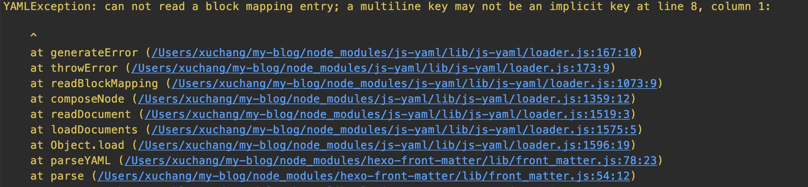
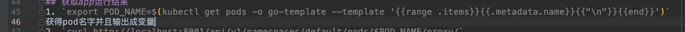

1. 写deploy时候不能换行，不然会报错，没法只显示description
`YAMLException: can not read a block mapping entry; a multiline key may not be an implicit key at line 8, column 1:`

2. 写概述https://blog.csdn.net/yueyue200830/article/details/104470646/
3. FATAL Something's wrong. Maybe you can find the solution here: https://hexo.io/docs/troubleshooting.html
   Nunjucks Error:  [Line 40, Column 95] unexpected token: .
   
   报错：
   
   报错代码：
   
   解决方式:https://blog.csdn.net/weixin_34209406/article/details/88986783
   http://www.w3school.com.cn/html/html_entities.asp