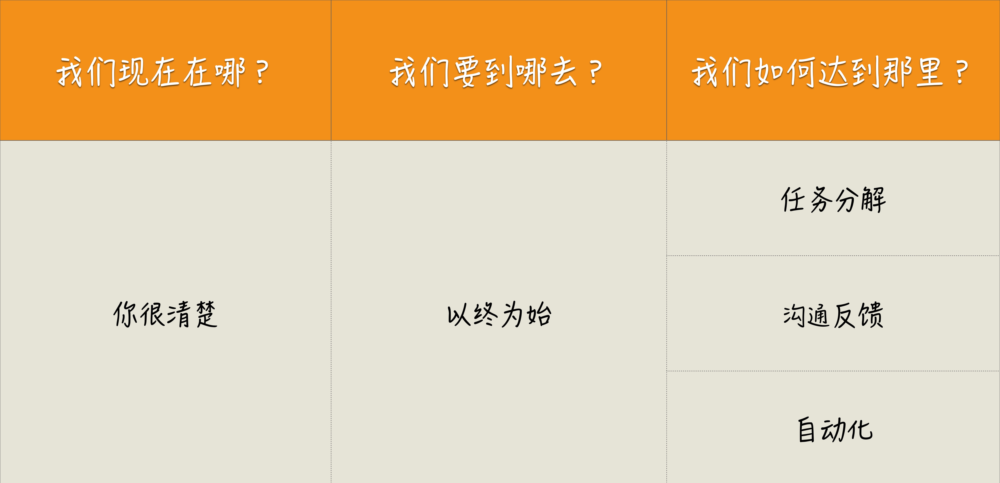

# 一个思考框架
Where are we?（我们现在在哪？）
Where are we going?（我们要到哪儿去？）
How can we get there?（我们如何到达那里？）

我现在是个什么水平？
我想达到一个什么水平？
我将怎样到达那个目标？

现状；
目标；
实现路径。
如果一个人能够清晰地回答出这三个问题，通常意味着他对要做的事有着清晰的认识。

# 四个思考原则
以终为始；
任务分解；
沟通反馈；
自动化。

以终为始就是在工作的一开始就确定好自己的目标。我们需要看到的是真正的目标，而不是把别人交代给我们的工作当作目标。你可以看出这个原则是在帮助我们回答思考框架中，Where are we going?（我们要到哪儿去？）这个问题。

任务分解是将大目标拆分成一个一个可行的执行任务，工作分解得越细致，我们便越能更好地掌控工作，它是帮助我们回答思维框架中，How can we get there?（我们如何到达那里？）的问题。

如果说前两个原则是要在动手之前做的分析，那后面两个原则就是在通往目标的道路上，为我们保驾护航，因为在实际工作中，我们少不了与人和机器打交道。

沟通反馈是为了疏通与其他人交互的渠道。一方面，我们保证信息能够传达出去，减少因为理解偏差造成的工作疏漏；另一方面，也要保证我们能够准确接收外部信息，以免因为自我感觉良好，阻碍了进步。

自动化就是将繁琐的工作通过自动化的方式交给机器执行，这是我们程序员本职工作的一部分，我们擅长的是为其他人打造自动化的服务，但自己的工作却应用得不够，这也是我们工作中最值得优化的部分。

这四个原则互相配合，形成了一个对事情的衡量标准。总体上可以保证我的工作是有效的，在明确目标和完成目标的过程中，都可以尽量减少偶然复杂度。

