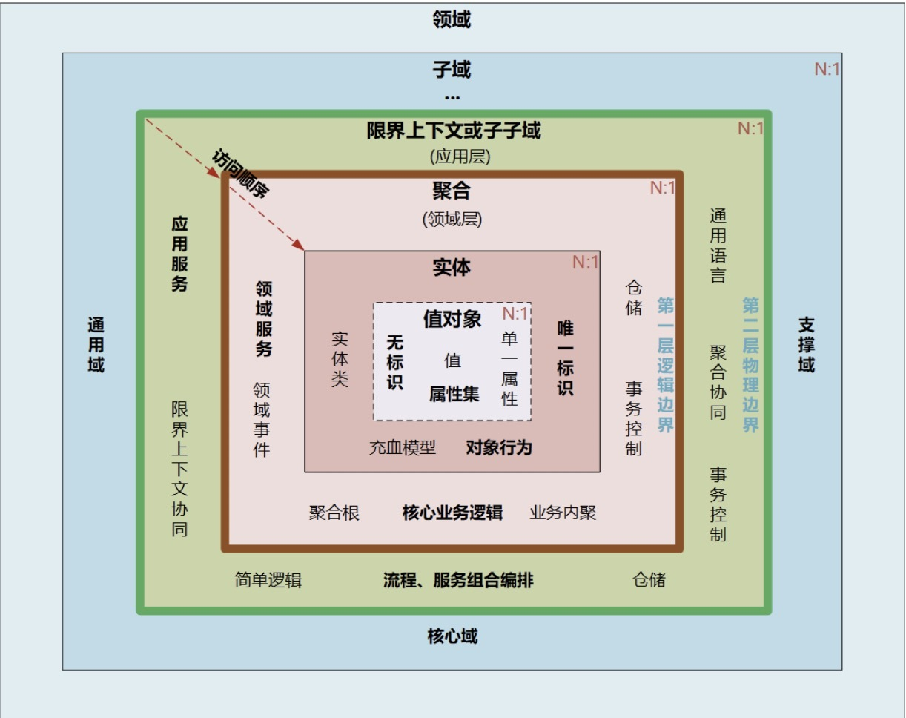
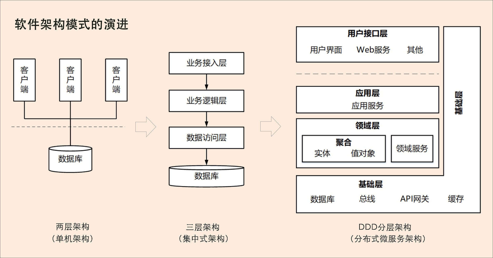
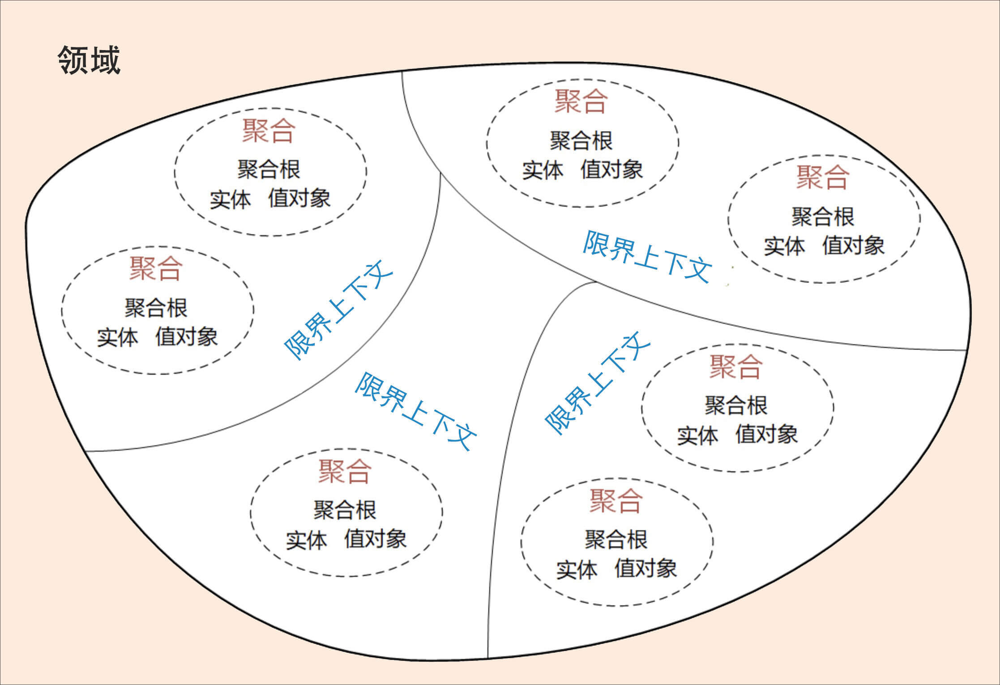
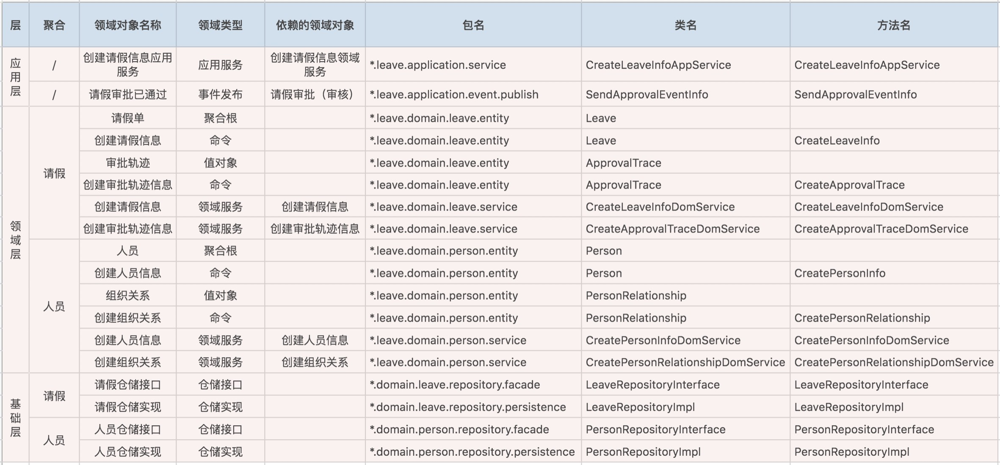
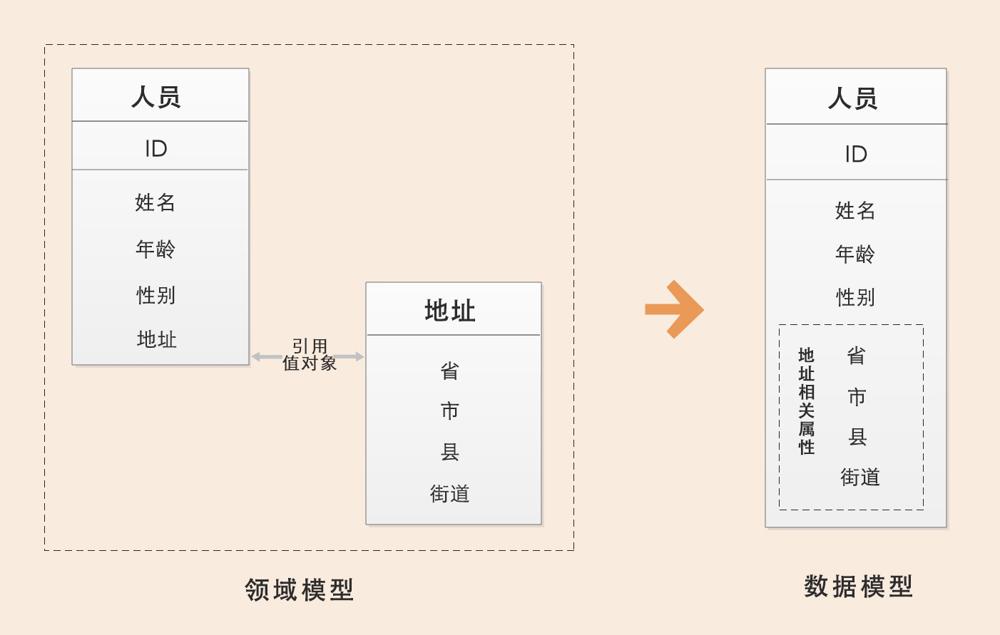
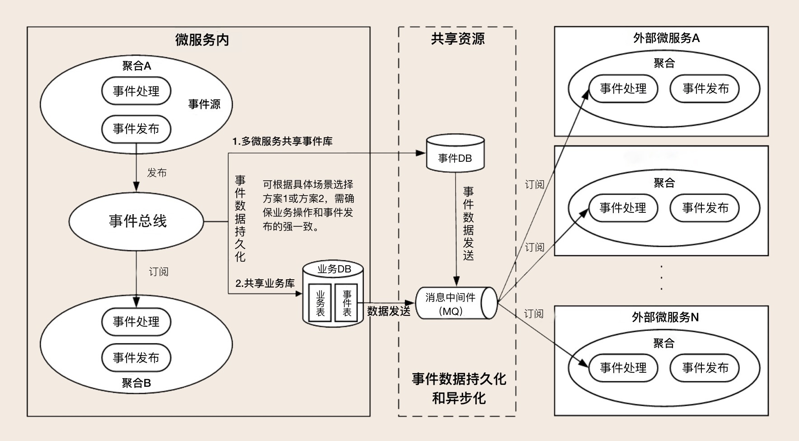
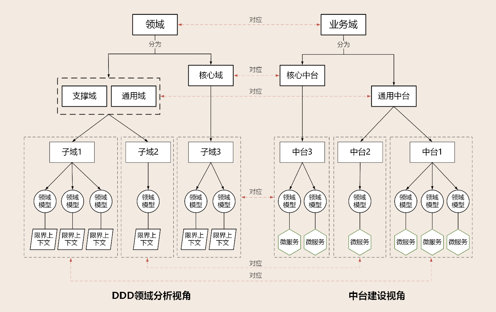
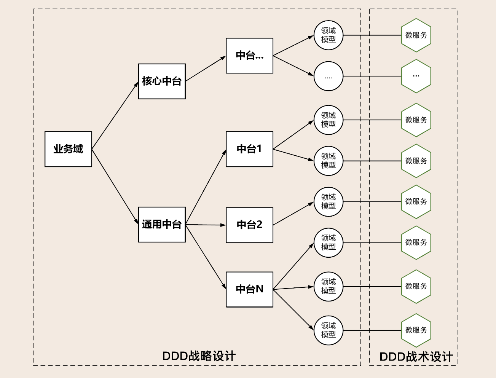

领域驱动设计 Domain-Driven Design

# 软件架构模式的演进

第一阶段是单机架构：采用面向过程的设计方法，系统包括客户端UI层和数据库两层，采用C/S架构模式，整个系统围绕数据库驱动设计和开发，并且总是从设计数据库和字段开始。

第二阶段是集中式架构：采用面向对象的设计方法，系统包括业务接入层、业务逻辑层和数据库层，采用经典的三层架构，也有部分应用采用传统的SOA架构。这种架构容易使系统变得臃肿，可扩展性和弹性伸缩性差。

第三阶段是分布式微服务架构：随着微服务架构理念的提出，集中式架构正向分布式微服务架构演进。微服务架构可以很好地实现应用之间的解耦，解决单体应用扩展性和弹性伸缩能力不足的问题。

我们知道，在单机和集中式架构时代，系统分析、设计和开发往往是独立、分阶段割裂进行的。

## DDD组成

DDD包括战略设计和战术设计两部分。

战略设计主要从业务视角出发，建立业务领域模型，划分领域边界，建立通用语言的限界上下文，限界上下文可以作为微服务设计的参考边界。
战术设计则从技术视角出发，侧重于领域模型的技术实现，完成软件开发和落地，包括：聚合根、实体、值对象、领域服务、应用服务和资源库等代码逻辑的设计和实现。

我们可以用三步来划定领域模型和微服务的边界。

第一步：在事件风暴中梳理业务过程中的用户操作、事件以及外部依赖关系等，根据这些要素梳理出领域实体等领域对象。

第二步：根据领域实体之间的业务关联性，将业务紧密相关的实体进行组合形成聚合，同时确定聚合中的聚合根、值对象和实体。在这个图里，聚合之间的边界是第一层边界，它们在同一个微服务实例中运行，这个边界是逻辑边界，所以用虚线表示。

第三步：根据业务及语义边界等因素，将一个或者多个聚合划定在一个限界上下文内，形成领域模型。在这个图里，限界上下文之间的边界是第二层边界，这一层边界可能就是未来微服务的边界，不同限界上下文内的领域逻辑被隔离在不同的微服务实例中运行，物理上相互隔离，所以是物理边界，边界之间用实线来表示。

# 概念

## 领域和子域

领域就是用来确定范围的，范围即边界，这也是DDD在设计中不断强调边界的原因。
DDD会按照一定的规则将业务领域进行细分，当领域细分到一定的程度后，DDD会将问题范围限定在特定的边界内，在这个边界内建立领域模型，进而用代码实现该领域模型，解决相应的业务问题。简言之，DDD的领域就是这个边界内要解决的业务问题域。
我们知道细胞核、线粒体、细胞膜等物质共同构成细胞，这些物质一起协作让细胞具有这类细胞特定的生物功能。在这里你可以把细胞理解为DDD的聚合，细胞内的这些物质就可以理解为聚合里面的聚合根、实体以及值对象等，在聚合内这些实体一起协作完成特定的业务功能。这个过程类似DDD设计时，确定微服务内功能要素和边界的过程。

    >exp
    第一步：确定研究对象，即研究领域，这里是一棵桃树。
    
    第二步：对研究对象进行细分，将桃树细分为器官，器官又分为营养器官和生殖器官两种。其中营养器官包括根、茎和叶，生殖器官包括花、果实和种子。桃树的知识体系是我们已经确定要研究的问题域，对应DDD的领域。根、茎、叶、花、果实和种子等器官则是细分后的问题子域。这个过程就是DDD将领域细分为多个子域的过程。
    
    第三步：对器官进行细分，将器官细分为组织。比如，叶子器官可细分为保护组织、营养组织和输导组织等。这个过程就是DDD将子域进一步细分为多个子域的过程。
    
    第四步：对组织进行细分，将组织细分为细胞，细胞成为我们研究的最小单元。细胞之间的细胞壁确定了单元的边界，也确定了研究的最小边界。

上面我们用自然科学研究的方法，说明了领域可以通过细分为子域的方法，来降低研究的复杂度。

## 核心域、通用域和支撑域

决定产品和公司核心竞争力的子域是核心域，它是业务成功的主要因素和公司的核心竞争力。没有太多个性化的诉求，同时被多个子域使用的通用功能子域是通用域。还有一种功能子域是必需的，但既不包含决定产品和公司核心竞争力的功能，也不包含通用功能的子域，它就是支撑域。

# 通用语言 & 限界上下文

有很多的参与者，包括领域专家、产品经理、项目经理、架构师、开发经理和测试经理等。对同样的领域知识，不同的参与角色可能会有不同的理解，那大家交流起来就会有障碍，怎么办呢？因此，在DDD中就出现了“通用语言”和“限界上下文”这两个重要的概念。
通用语言定义上下文含义，限界上下文则定义领域边界，以确保每个上下文含义在它特定的边界内都具有唯一的含义，领域模型则存在于这个边界之内。

## 通用语言

通过团队交流达成共识的，能够简单、清晰、准确描述业务涵义和规则的语言就是通用语言。也就是说，通用语言是团队统一的语言，不管你在团队中承担什么角色，在同一个领域的软件生命周期里都使用统一的语言进行交流。
通用语言的价值也就很明了了，它可以解决交流障碍这个问题，使领域专家和开发人员能够协同合作，从而确保业务需求的正确表达。
通用语言包含术语和用例场景，并且能够直接反映在代码中。通用语言中的名词可以给领域对象命名，如商品、订单等，对应实体对象；而动词则表示一个动作或事件，如商品已下单、订单已付款等，对应领域事件或者命令。

在事件风暴的过程中，领域专家会和设计、开发人员一起建立领域模型，在领域建模的过程中会形成通用的业务术语和用户故事。事件风暴也是一个项目团队统一语言的过程。
通过用户故事分析会形成一个个的领域对象，这些领域对象对应领域模型的业务对象，每一个业务对象和领域对象都有通用的名词术语，并且一一映射。 微服务代码模型来源于领域模型，每个代码模型的代码对象跟领域对象一一对应。

## 限界上下文

我们知道语言都有它的语义环境，同样，通用语言也有它的上下文环境。为了避免同样的概念或语义在不同的上下文环境中产生歧义，DDD在战略设计上提出了“限界上下文”这个概念，用来确定语义所在的领域边界。
我们可以将限界上下文拆解为两个词：限界和上下文。限界就是领域的边界，而上下文则是语义环境。通过领域的限界上下文，我们就可以在统一的领域边界内用统一的语言进行交流。

限界上下文的定义就是：用来封装通用语言和领域对象，提供上下文环境，保证在领域之内的一些术语、业务相关对象等（通用语言）有一个确切的含义，没有二义性。这个边界定义了模型的适用范围，使团队所有成员能够明确地知道什么应该在模型中实现，什么不应该在模型中实现。

# 实体和值对象

## 实体

在DDD中有这样一类对象，它们拥有唯一标识符，且标识符在历经各种状态变更后仍能保持一致。对这些对象而言，重要的不是其属性，而是其延续性和标识，对象的延续性和标识会跨越甚至超出软件的生命周期。我们把这样的对象称为实体。

## 值对象

值对象描述了领域中的一件东西，这个东西是不可变的，它将不同的相关属性组合成了一个概念整体。当度量和描述改变时，可以用另外一个值对象予以替换。它可以和其它值对象进行相等性比较，且不会对协作对象造成副作用。

值对象本质上就是一个集。那这个集合里面有什么呢？若干个用于描述目的、具有整体概念和不可修改的属性。那这个集合存在的意义又是什么？在领域建模的过程中，值对象可以保证属性归类的清晰和概念的完整性，避免属性零碎。

## 实体和值对象的关系

实体和值对象是微服务底层的最基础的对象，一起实现实体最基本的核心领域逻辑。
传统的数据模型设计通常是一个表对应一个实体，一个主表关联多个从表，当实体表太多的时候就很容易陷入无穷无尽的复杂的数据库设计，领域模型就很容易被数据模型绑架。可以说，值对象的诞生，在一定程度上，和实体是互补的。
在领域模型中人员是实体，地址是值对象，地址值对象被人员实体引用。在数据模型设计时，地址值对象可以作为一个属性集整体嵌入人员实体中，组合形成上图这样的数据模型；也可以以序列化大对象的形式加入到人员的地址属性中，前面表格有展示。

# 聚合和聚合根

## 聚合

聚合就是由业务和逻辑紧密关联的实体和值对象组合而成的，聚合是数据修改和持久化的基本单元，每一个聚合对应一个仓储，实现数据的持久化。

聚合有一个聚合根和上下文边界，这个边界根据业务单一职责和高内聚原则，定义了聚合内部应该包含哪些实体和值对象，而聚合之间的边界是松耦合的。按照这种方式设计出来的微服务很自然就是“高内聚、低耦合”的。

聚合在DDD分层架构里属于领域层，领域层包含了多个聚合，共同实现核心业务逻辑。聚合内实体以充血模型实现个体业务能力，以及业务逻辑的高内聚。跨多个实体的业务逻辑通过领域服务来实现，跨多个聚合的业务逻辑通过应用服务来实现。比如有的业务场景需要同一个聚合的A和B两个实体来共同完成，我们就可以将这段业务逻辑用领域服务来实现；而有的业务逻辑需要聚合C和聚合D中的两个服务共同完成，这时你就可以用应用服务来组合这两个服务。

## 聚合根

聚合根的主要目的是为了避免由于复杂数据模型缺少统一的业务规则控制，而导致聚合、实体之间数据不一致性的问题。

如果把聚合比作组织，那聚合根就是这个组织的负责人。聚合根也称为根实体，它不仅是实体，还是聚合的管理者。

首先它作为实体本身，拥有实体的属性和业务行为，实现自身的业务逻辑。

其次它作为聚合的管理者，在聚合内部负责协调实体和值对象按照固定的业务规则协同完成共同的业务逻辑。

最后在聚合之间，它还是聚合对外的接口人，以聚合根ID关联的方式接受外部任务和请求，在上下文内实现聚合之间的业务协同。也就是说，聚合之间通过聚合根ID关联引用，如果需要访问其它聚合的实体，就要先访问聚合根，再导航到聚合内部实体，外部对象不能直接访问聚合内实体。

## 设计聚合

### 步骤

第 1 步：采用事件风暴，根据业务行为，梳理出在投保过程中发生这些行为的所有的实体和值对象，比如投保单、标的、客户、被保人等等。

第 2
步：从众多实体中选出适合作为对象管理者的根实体，也就是聚合根。判断一个实体是否是聚合根，你可以结合以下场景分析：是否有独立的生命周期？是否有全局唯一ID？是否可以创建或修改其它对象？是否有专门的模块来管这个实体。图中的聚合根分别是投保单和客户实体。

第 3 步：根据业务单一职责和高内聚原则，找出与聚合根关联的所有紧密依赖的实体和值对象。构建出 1 个包含聚合根（唯一）、多个实体和值对象的对象集合，这个集合就是聚合。在图中我们构建了客户和投保这两个聚合。

第 4
步：在聚合内根据聚合根、实体和值对象的依赖关系，画出对象的引用和依赖模型。这里我需要说明一下：投保人和被保人的数据，是通过关联客户ID从客户聚合中获取的，在投保聚合里它们是投保单的值对象，这些值对象的数据是客户的冗余数据，即使未来客户聚合的数据发生了变更，也不会影响投保单的值对象数据。从图中我们还可以看出实体之间的引用关系，比如在投保聚合里投保单聚合根引用了报价单实体，报价单实体则引用了报价规则子实体。

第 5 步：多个聚合根据业务语义和上下文一起划分到同一个限界上下文内。

### 原则

1.
在一致性边界内建模真正的不变条件。聚合用来封装真正的不变性，而不是简单地将对象组合在一起。聚合内有一套不变的业务规则，各实体和值对象按照统一的业务规则运行，实现对象数据的一致性，边界之外的任何东西都与该聚合无关，这就是聚合能实现业务高内聚的原因。

2. 设计小聚合。如果聚合设计得过大，聚合会因为包含过多的实体，导致实体之间的管理过于复杂，高频操作时会出现并发冲突或者数据库锁，最终导致系统可用性变差。而小聚合设计则可以降低由于业务过大导致聚合重构的可能性，让领域模型更能适应业务的变化。

3. 通过唯一标识引用其它聚合。聚合之间是通过关联外部聚合根ID的方式引用，而不是直接对象引用的方式。外部聚合的对象放在聚合边界内管理，容易导致聚合的边界不清晰，也会增加聚合之间的耦合度。

4. 在边界之外使用最终一致性。聚合内数据强一致性，而聚合之间数据最终一致性。在一次事务中，最多只能更改一个聚合的状态。如果一次业务操作涉及多个聚合状态的更改，应采用领域事件的方式异步修改相关的聚合，实现聚合之间的解耦。

5. 通过应用层实现跨聚合的服务调用。为实现微服务内聚合之间的解耦，以及未来以聚合为单位的微服务组合和拆分，应避免跨聚合的领域服务调用和跨聚合的数据库表关联。

### 示例

# 领域事件，解耦微服务

领域事件是领域模型中非常重要的一部分，用来表示领域中发生的事件。一个领域事件将导致进一步的业务操作，在实现业务解耦的同时，还有助于形成完整的业务闭环。

聚合的一个设计原则：在边界之外使用最终一致性。一次事务最多只能更改一个聚合的状态。如果一次业务操作涉及多个聚合状态的更改，应采用领域事件的最终一致性。

领域事件驱动设计可以切断领域模型之间的强依赖关系，事件发布完成后，发布方不必关心后续订阅方事件处理是否成功，这样可以实现领域模型的解耦，维护领域模型的独立性和数据的一致性。在领域模型映射到微服务系统架构时，领域事件可以解耦微服务，微服务之间的数据不必要求强一致性，而是基于事件的最终一致性。

## 微服务内的领域事件

当领域事件发生在微服务内的聚合之间，领域事件发生后完成事件实体构建和事件数据持久化，发布方聚合将事件发布到事件总线，订阅方接收事件数据完成后续业务操作。

微服务内大部分事件的集成，都发生在同一个进程内，进程自身可以很好地控制事务，因此不一定需要引入消息中间件。但一个事件如果同时更新多个聚合，按照DDD“一次事务只更新一个聚合”的原则，你就要考虑是否引入事件总线。但微服务内的事件总线，可能会增加开发的复杂度，因此你需要结合应用复杂度和收益进行综合考虑。

微服务内应用服务，可以通过跨聚合的服务编排和组合，以服务调用的方式完成跨聚合的访问，这种方式通常应用于实时性和数据一致性要求高的场景。这个过程会用到分布式事务，以保证发布方和订阅方的数据同时更新成功。

## 微服务之间的领域事件

跨微服务的领域事件会在不同的限界上下文或领域模型之间实现业务协作，其主要目的是实现微服务解耦，减轻微服务之间实时服务访问的压力。

领域事件发生在微服务之间的场景比较多，事件处理的机制也更加复杂。跨微服务的事件可以推动业务流程或者数据在不同的子域或微服务间直接流转。

跨微服务的事件机制要总体考虑事件构建、发布和订阅、事件数据持久化、消息中间件，甚至事件数据持久化时还可能需要考虑引入分布式事务机制等。

微服务之间的访问也可以采用应用服务直接调用的方式，实现数据和服务的实时访问，弊端就是跨微服务的数据同时变更需要引入分布式事务，以确保数据的一致性。分布式事务机制会影响系统性能，增加微服务之间的耦合，所以我们还是要尽量避免使用分布式事务。

## 领域事件总体架构

1. 事件构建和发布
    1. 为了保证事件结构的统一，我们还会创建事件基类 DomainEvent（参考下图），子类可以扩充属性和方法。由于事件没有太多的业务行为，实现方法一般比较简单。
    2. [事件基类.jpeg](领域驱动设计DDD/事件基类.jpeg)
2. 事件数据持久化
3. 事件总线(EventBus)-》很像dealupdate
    1. 事件总线是实现微服务内聚合之间领域事件的重要组件，它提供事件分发和接收等服务。事件总线是进程内模型，它会在微服务内聚合之间遍历订阅者列表，采取同步或异步的模式传递数据。事件分发流程大致如下：
        - 如果是微服务内的订阅者（其它聚合），则直接分发到指定订阅者；
        - 如果是微服务外的订阅者，将事件数据保存到事件库（表）并异步发送到消息中间件；
        - 如果同时存在微服务内和外订阅者，则先分发到内部订阅者，将事件消息保存到事件库（表），再异步发送到消息中间件。
4. 消息中间件
5. 事件接收和处理

# DDD分层架构：有效降低层与层之间的依赖

[四层架构.jpeg](领域驱动设计DDD/四层架构.jpeg)

1.用户接口层

用户接口层负责向用户显示信息和解释用户指令。这里的用户可能是：用户、程序、自动化测试和批处理脚本等等。

2.应用层

应用层是很薄的一层，理论上不应该有业务规则或逻辑，主要面向用例和流程相关的操作。但应用层又位于领域层之上，因为领域层包含多个聚合，所以它可以协调多个聚合的服务和领域对象完成服务编排和组合，协作完成业务操作。

此外，应用层也是微服务之间交互的通道，它可以调用其它微服务的应用服务，完成微服务之间的服务组合和编排。

这里我要提醒你一下：在设计和开发时，不要将本该放在领域层的业务逻辑放到应用层中实现。因为庞大的应用层会使领域模型失焦，时间一长你的微服务就会演化为传统的三层架构，业务逻辑会变得混乱。

另外，应用服务是在应用层的，它负责服务的组合、编排和转发，负责处理业务用例的执行顺序以及结果的拼装，以粗粒度的服务通过API网关向前端发布。还有，应用服务还可以进行安全认证、权限校验、事务控制、发送或订阅领域事件等。

3.领域层

领域层的作用是实现企业核心业务逻辑，通过各种校验手段保证业务的正确性。领域层主要体现领域模型的业务能力，它用来表达业务概念、业务状态和业务规则。

领域层包含聚合根、实体、值对象、领域服务等领域模型中的领域对象。

这里我要特别解释一下其中几个领域对象的关系，以便你在设计领域层的时候能更加清楚。首先，领域模型的业务逻辑主要是由实体和领域服务来实现的，其中实体会采用充血模型来实现所有与之相关的业务功能。其次，你要知道，实体和领域服务在实现业务逻辑上不是同级的，当领域中的某些功能，单一实体（或者值对象）不能实现时，领域服务就会出马，它可以组合聚合内的多个实体（或者值对象），实现复杂的业务逻辑。

4.基础层

基础层是贯穿所有层的，它的作用就是为其它各层提供通用的技术和基础服务，包括第三方工具、驱动、消息中间件、网关、文件、缓存以及数据库等。比较常见的功能还是提供数据库持久化。

基础层包含基础服务，它采用依赖倒置设计，封装基础资源服务，实现应用层、领域层与基础层的解耦，降低外部资源变化对应用的影响。

## DDD分层架构有一个重要的原则：每层只能与位于其下方的层发生耦合。

## DDD分层架构如何推动架构演进

### 微服务演进

领域模型不是一成不变的，因为业务的变化会影响领域模型，而领域模型的变化则会影响微服务的功能和边界。

[DDD微服务演进.jpeg](领域驱动设计DDD/DDD微服务演进.jpeg)

### 服务内演进

在微服务内部，实体的方法被领域服务组合和封装，领域服务又被应用服务组合和封装。
有一天你会发现领域服务b和c同时多次被多个应用服务调用了，执行顺序也基本一致。这时你可以考虑将b和c合并，再将应用服务中b、c的功能下沉到领域层，演进为新的领域服务（b+c）。这样既减少了服务的数量，也减轻了上层服务组合和编排的复杂度。

[服务内演进.jpeg](领域驱动设计DDD/服务内演进.jpeg)

### 架构演进

[架构演进.jpeg](领域驱动设计DDD/架构演进.jpeg)

# 微服务架构模型：几种常见模型的对比和分析

## 整洁架构/洋葱架构

[整洁架构.jpeg](领域驱动设计DDD/整洁架构.jpeg)

- 领域模型实现领域内核心业务逻辑，它封装了企业级的业务规则。领域模型的主体是实体，一个实体可以是一个带方法的对象，也可以是一个数据结构和方法集合。
- 领域服务实现涉及多个实体的复杂业务逻辑。
- 应用服务实现与用户操作相关的服务组合与编排，它包含了应用特有的业务流程规则，封装和实现了系统所有用例。
- 最外层主要提供适配的能力，适配能力分为主动适配和被动适配。主动适配主要实现外部用户、网页、批处理和自动化测试等对内层业务逻辑访问适配。被动适配主要是实现核心业务逻辑对基础资源访问的适配，比如数据库、缓存、文件系统和消息中间件等。
- 红圈内的领域模型、领域服务和应用服务一起组成软件核心业务能力。

## 六边形架构/端口适配器架构

[六边形架构.jpeg](领域驱动设计DDD/六边形架构.jpeg)

六边形架构的核心理念是：应用是通过端口与外部进行交互的。

红圈内的六边形实现应用的核心业务逻辑； 外六边形完成外部应用、驱动和基础资源等的交互和访问，对前端应用以API主动适配的方式提供服务，对基础资源以依赖倒置被动适配的方式实现资源访问。

## 模型对比

[模型对比.png](领域驱动设计DDD/模型对比.png)
红色框内部主要实现核心业务逻辑，但核心业务逻辑也是有差异的，有的业务逻辑属于领域模型的能力，有的则属于面向用户的用例和流程编排能力。按照这种功能的差异，我们在这三种架构中划分了应用层和领域层，来承担不同的业务逻辑。

领域层实现面向领域模型，实现领域模型的核心业务逻辑，属于原子模型，它需要保持领域模型和业务逻辑的稳定，对外提供稳定的细粒度的领域服务，所以它处于架构的核心位置。

应用层实现面向用户操作相关的用例和流程，对外提供粗粒度的API服务。它就像一个齿轮一样进行前台应用和领域层的适配，接收前台需求，随时做出响应和调整，尽量避免将前台需求传导到领域层。应用层作为配速齿轮则位于前台应用和领域层之间。

这三种架构都考虑了前端需求的变与领域模型的不变。需求变幻无穷，但变化总是有矩可循的，用户体验、操作习惯、市场环境以及管理流程的变化，往往会导致界面逻辑和流程的多变。但总体来说，不管前端如何变化，在企业没有大的变革的情况下，核心领域逻辑基本不会大变，所以领域模型相对稳定，而用例和流程则会随着外部应用需求而随时调整

## 中台和微服务设计

中台本质上是领域的子域，它可能是核心域，也可能是通用域或支撑域。

### 中台建设要聚焦领域模型

中台需要站在全企业的高度考虑能力的共享和复用。

中台设计时，我们需要建立中台内所有限界上下文的领域模型，DDD建模过程中会考虑架构演进和功能的重新组合。领域模型建立的过程会对业务和应用进行清晰的逻辑和物理边界（微服务）划分。领域模型的结果会影响到后续的系统模型、架构模型和代码模型，最终影响到微服务的拆分和项目落地。

因此，在中台设计中我们首先要聚焦领域模型，将它放在核心位置。

### 微服务架构分层

1. 项目级微服务
   [项目级微服务.png](领域驱动设计DDD/项目级微服务.png)

2. 企业级中台微服务
   [企业级中台微服务.png](领域驱动设计DDD/企业级中台微服务.png)

# 中台

## 平台 & 中台

平台只是将部分通用的公共能力独立为共享平台。虽然可以通过API或者数据对外提供公共共享服务，解决系统重复建设的问题，但这类平台并没有和企业内的其它平台或应用，实现页面、业务流程和数据从前端到后端的全面融合，并且没有将核心业务服务链路作为一个整体方案考虑，各平台仍然是分离且独立的。

平台解决了公共能力复用的问题，但离中台的目标显然还有一段差距！

[中台模型.jpeg](领域驱动设计DDD/中台模型.jpeg)
阿里的前中后台划分面向业务人员。

前台主要面向客户以及终端销售者，实现营销推广以及交易转化；中台主要面向运营人员，完成运营支撑；后台主要面向后台管理人员，实现流程审核、内部管理以及后勤支撑，比如采购、人力、财务和OA等系统。

中台的本质其实就是提炼各个业务板块的共同需求，进行业务和系统抽象，形成通用的可复用的业务模型，打造成组件化产品，供前台部门使用。前台要做什么业务，需要什么资源，可以直接找中台，不需要每次都去改动自己的底层。

## 前台

中台后的前台建设要有一套综合考虑业务边界、流程和平台的整体解决方案，以实现各不同中台前端操作、流程和界面的联通、融合。不管后端有多少个中台，前端用户感受到的就是只有一个前台。

## 中台

业务中台的建设可采用领域驱动设计方法，通过领域建模，将可复用的公共能力从各个单体剥离，沉淀并组合，采用微服务架构模式，建设成为可共享的通用能力中台。

中台建设问题
在将传统集中式单体按业务职责和能力细分为微服务，建设中台的过程中，会产生越来越多的独立部署的微服务。这样做虽然提升了应用弹性和高可用能力，但由于微服务的物理隔离，原来一些系统内的调用会变成跨微服务调用，再加上前后端分离，微服务拆分会导致数据进一步分离，增加企业级应用集成的难度。

如果没有合适的设计和指导思想，处理不好前台、中台和后台的关系，将会进一步加剧前台流程和数据的孤岛化、碎片化。

数据中台的主要目标是打通数据孤岛，实现业务融合和创新，包括三大主要职能：

一是完成企业全域数据的采集与存储，实现各不同业务类别中台数据的汇总和集中管理。 二是按照标准的数据规范或数据模型，**将数据按照不同主题域或场景进行加工和处理，形成面向不同主题和场景的数据应用**
，比如客户视图、代理人视图、渠道视图、机构视图等不同数据体系。 三是建立业务需求驱动的数据体系，基于各个维度的数据，深度萃取数据价值，支持业务和商业模式的创新。

相应的，数据中台的建设就可分为三步走：

第一步实现各中台业务数据的汇集，解决数据孤岛和初级数据共享问题。 第二步实现企业级实时或非实时全维度数据的深度融合、加工和共享。 第三步萃取数据价值，支持业务创新，加速从数据转换为业务价值的过程。

## 后台

那对于后台，为了实现内部的管理要求，很多人习惯性将这些管理要求嵌入到核心业务流程中。而一般来说这类内控管理需求对权限、管控规则和流程等要求都比较高，但是大部分管理人员只是参与了某个局部业务环节的审核。这类复杂的管理需求，会凭空增加不同渠道应用前台界面和核心流程的融合难度以及软件开发的复杂度。

## 中台建设模型

## 建模流程
第一步：按照业务流程（通常适用于核心域）或者功能属性、集合（通常适用于通用域或支撑域），将业务域细分为多个中台，再根据功能属性或重要性归类到核心中台或通用中台。核心中台设计时要考虑核心竞争力，通用中台要站在企业高度考虑共享和复用能力。

第二步：选取中台，根据用例、业务场景或用户旅程完成事件风暴，找出实体、聚合和限界上下文。依次进行领域分解，建立领域模型。

由于不同中台独立建模，某些领域对象或功能可能会重复出现在其它领域模型中，也有可能本该是同一个聚合的领域对象或功能，却分散在其它的中台里，这样会导致领域模型不完整或者业务不内聚。这里先不要着急，这一步我们只需要初步确定主领域模型就可以了，在第三步中我们还会提炼并重组这些领域对象。

第三步：以主领域模型为基础，扫描其它中台领域模型，检查并确定是否存在重复或者需要重组的领域对象、功能，提炼并重构主领域模型，完成最终的领域模型设计。

第四步：选择其它主领域模型重复第三步，直到所有主领域模型完成比对和重构。

第五步：基于领域模型完成微服务设计，完成系统落地。

# 重构业务方式
## 自顶向下
第一种策略是自顶向下。这种策略是先做顶层设计，从最高领域逐级分解为中台，分别建立领域模型，根据业务属性分为通用中台或核心中台。领域建模过程主要基于业务现状，暂时不考虑系统现状。自顶向下的策略适用于全新的应用系统建设，或旧系统推倒重建的情况。

由于这种策略不必受限于现有系统，你可以用DDD领域逐级分解的领域建模方法。从下面这张图我们可以看出它的主要步骤：第一步是将领域分解为子域，子域可以分为核心域、通用域和支撑域；第二步是对子域建模，划分领域边界，建立领域模型和限界上下文；第三步则是根据限界上下文进行微服务设计。

## 自底向上
这种策略是基于业务和系统现状完成领域建模。首先分别完成系统所在业务域的领域建模；然后对齐业务域，找出具有同类或相似业务功能的领域模型，对比分析领域模型的差异，重组领域对象，重构领域模型。这个过程会沉淀公共和复用的业务能力，会将分散的业务模型整合。自底向上策略适用于遗留系统业务模型的演进式重构。

第一步：锁定系统所在业务域，构建领域模型。

第二步：对齐业务域，构建中台业务模型。

看完【11 DDD实践】

