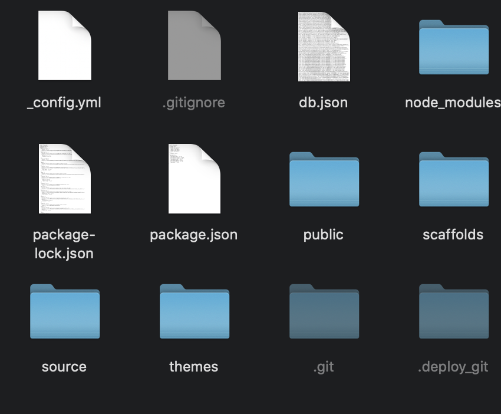
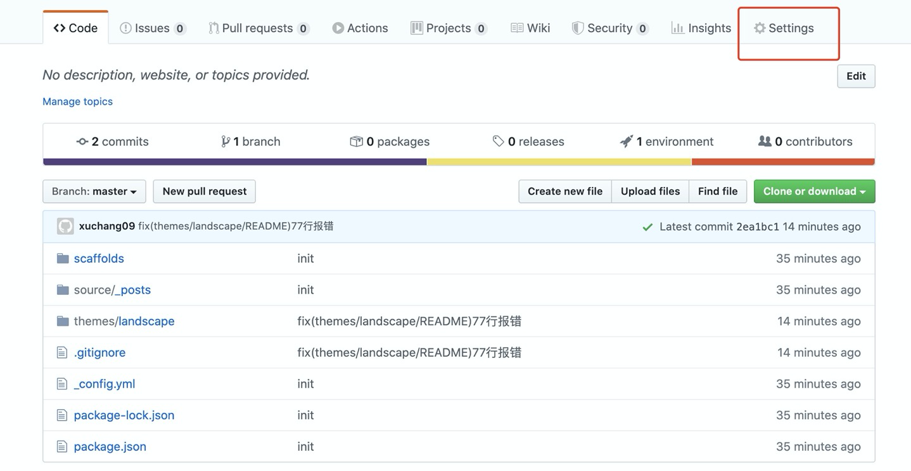
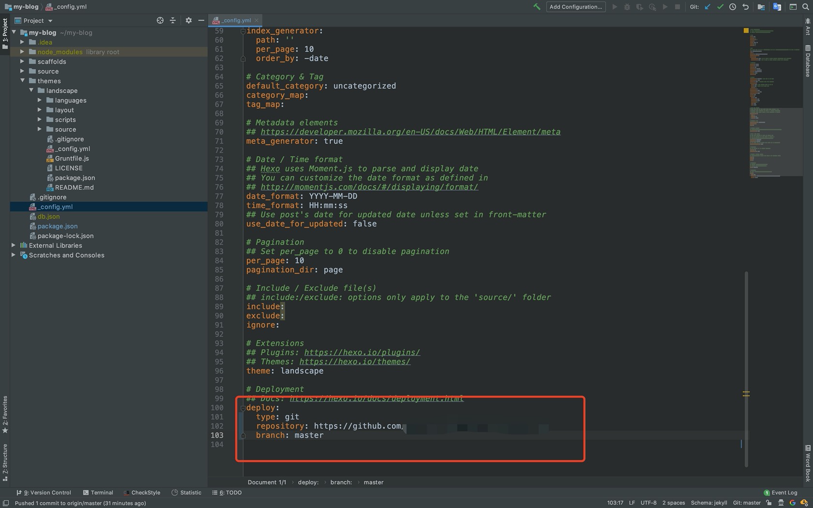

终于～把博客搭建起来啦，第一篇就在这里简单讲述下博客搭建的过程。
这里只记录最简单通过hexo和github搭建博客的方法。

# 相关网站
[hexo](https://hexo.io/zh-cn/)、[github](https://github.com/)、[nodejs](https://nodejs.org/en/)

# 博客搭建
## github账号准备
首先需要一个github账号～

访问[github](https://github.com/)右上角signup注册，根据相关提示即可get一个账号。

后边需要安装git及创建相关仓库可以参照相关教程操作。

## nodejs安装
hexo本身是基于nodejs运行的，所以安装hexo之前首先要给电脑上安装nodejs。

访问[nodejs官网](https://nodejs.org/en/)获得相关安装包，

左侧为最新稳定版，右侧是最新版。或者可以访问[nodejs中文网](http://nodejs.cn/download/)获得相关安装包。

安装后输入相关命令可以获得当前系统node版本和npm版本说明安装成功。
    ```shell script
    node --version
    v12.16.3
    npm --version
    6.14.4
    ```
### npm配置国内镜像
由于npm的仓库源在国外，国内使用相对速度较慢。可以使用淘宝npm镜像源进行替代。

- 官方网站：http://npm.taobao.org/
- 仓库地址：http://registry.npm.taobao.org/

使用方法有如下两种
1. 临时使用，在使用npm命令时添加参数，如
    ```shell script
    npm --registry https://registry.npm.taobao.org install hexo
    ```
2. 永久配置镜像源
    ```shell script
    npm config set registry https://registry.npm.taobao.org
    ```
配置后可以通过如下三个命令中任何一个检查是否配置成功
    ```shell script
    npm config ls
    npm config get registry
    npm info express
    ```

## 安装hexo
nodejs安装成功后安装hexo需输入如下命令。安装时注意权限问题，加上sudo，其中-g表示全局安装。
    ```shell script
    sudo npm install -g hexo
    ```

## 创建github仓库
在[github](https://github.com/)上创建一个新的仓库，
这里必须用`用户名.github.io`作为仓库名，否则后边会报404无法访问，可参照
[github page帮助文档](https://help.github.com/en/github/working-with-github-pages)


## 初始化博客
创建一个空文件夹作为博客系统存放位置，下文称作blog文件夹，在终端里进入创建好的文件夹，通过
    ```shell script
    hexo init
    ```
命令初始化博客系统，hexo会自动下载相关文件(请忽略下图的隐藏文件夹)

其中文件作用大致如下

- _config.yml：博客系统的一些配置，比如之后要用到的皮肤主题等等
- public：hexo最终生成的静态文件，也就是最终发布网站的文件(比如markdown文件转化成的html)
- scaffolds：通用的markdowb模板
- source：markdown文件，也就是写好的文章，初始化的hexo会在这里有一个hello-world文件用来默认展示。
- themes：博客的皮肤，比如最开始刚初始化的hexo博客系统一般都会在这里有一个landscape文件夹，
这就是hexo的原始皮肤主题～

## 推送博客代码到远程仓库
1. 在blog文件夹中初始化git仓库
    ```shell script
    git init
    ```
2. 添加所有现有文件，并提交本地代码
    ```shell script
    git add .
    git commit -m "init"
    ```
3. 推送代码到`用户名.github.io`的仓库
参照仓库中的

命令执行即可

*注*上述三个步骤可以参照git相关教程进行

### 排错
按照上述操作之后，可能会在仓库的setting页面看到如下报错
setting页面入口

报错

> “Your site is having problems building: The tag fancybox on line 77 in themes/landscape/README.md is not a recognized Liquid tag. For more information, see https://help.github.com/articles/page-build-failed-unknown-tag-error/.”


## 部署运行
### 本地部署
回到blog文件夹，执行
    ```shell script
    hexo s
    ```
会出现如下输出并在本地的4000端口运行博客系统。


至此说明本地运行成功。

命令行中按ctrl+c退出本地运行
### github部署
在_config.yml中修改如下配置
    ```yaml
    deploy:
      type: git
      repository: https://github.com/用户名/用户名.github.io
      branch: master
    ```
其中"用户名"需替换为实际github用户名，输入`hexo d`命令将系统部署到github
#### 排错
输入`hexo d`命令控制台可能会报错
> ERROR Deployer not found: git

这是因为缺少相关组件，输入
    ```shell script
    npm install --save hexo-deployer-git
    ```
安装相关组件后再次输入`hexo d`即可成功部署

## 访问个人博客
至此个人博客应该已经部署到github上了，输入网址``用户名.github.io`即可访问(其中"用户名"需替换为实际github用户名)。

